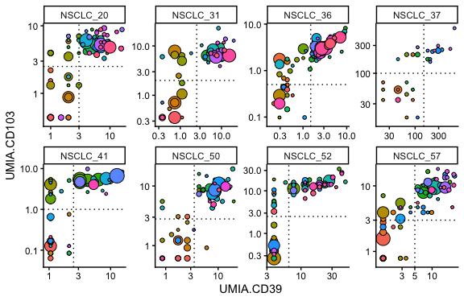
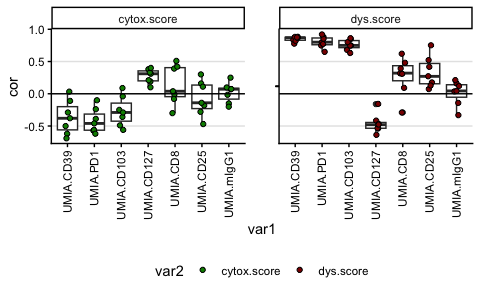
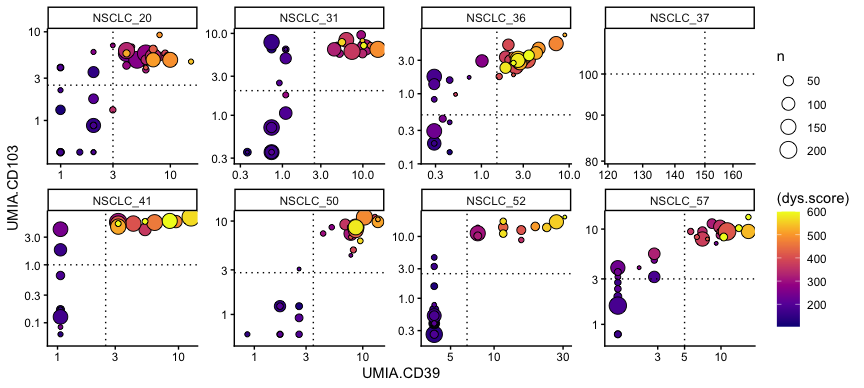
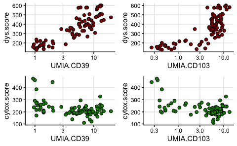
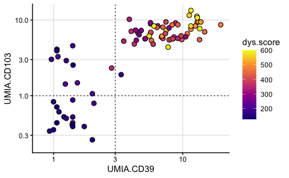

scRNAseq NSCLC cyt/dys scores
================
Kaspar Bresser
18/012/2025

- [Import data](#import-data)
- [Gene expression](#gene-expression)
- [Check scores by surface
  expression](#check-scores-by-surface-expression)
- [Dysfunction/Cytox signature](#dysfunctioncytox-signature)
- [correlation with CITE-seq](#correlation-with-cite-seq)

Comparative analysis of the cytotoxicity/dysfunction gene-scores to the
CITE-seq antibody stainings

``` r
library(Seurat)
library(metacell)
library(tidyverse)
library(lemon)
library(ggpubr)
library(rstatix)
```

## Import data

Import the MetaCell object

``` r
scdb_init("Data")
mc <- scdb_mc("NSCLC_MC_reordered")
```

Extract the patient info from the mat object

``` r
mat.obj <- scdb_mat("NSCLC_filt")

mat.obj@cell_metadata %>% 
  select(Patient) %>% 
  as_tibble(rownames = "cellcode") -> patients

patients
```

    ## # A tibble: 13,381 × 2
    ##    cellcode                  Patient 
    ##    <chr>                     <chr>   
    ##  1 S7109_S2_AAACCTGAGATGGCGT NSCLC_52
    ##  2 S7109_S2_AAACCTGAGCTGCAAG NSCLC_41
    ##  3 S7109_S2_AAACCTGAGGGTGTGT NSCLC_52
    ##  4 S7109_S2_AAACCTGAGTCATCCA NSCLC_41
    ##  5 S7109_S2_AAACCTGAGTGAAGAG NSCLC_41
    ##  6 S7109_S2_AAACCTGCATTGGCGC NSCLC_41
    ##  7 S7109_S2_AAACCTGGTACTCGCG NSCLC_52
    ##  8 S7109_S2_AAACCTGTCCAAACAC NSCLC_41
    ##  9 S7109_S2_AAACCTGTCGACCAGC NSCLC_52
    ## 10 S7109_S2_AAACGGGAGACTTGAA NSCLC_41
    ## # ℹ 13,371 more rows

## Gene expression

Import Seurat object and Normalize the data

``` r
seurat.obj <- read_rds("Data/CD8_NSCLC_filt.rds")
seurat.obj <- NormalizeData(seurat.obj, assay = "RNA", normalization.method = "CLR")
```

    ## Warning in asMethod(object): sparse->dense coercion: allocating vector of size
    ## 3.1 GiB

Define function to extract counts per gene per cellcode from the seurat
object

``` r
get_expression <- function(gene.list){
  
 seurat.obj %>% 
  GetAssayData( layer = "data", assay = "RNA")%>% 
  t() %>% 
  as.data.frame() %>% 
  as_tibble(rownames = "cellcode") %>% 
  select(one_of(c("cellcode", gene.list)))
  
}
```

## Check scores by surface expression

get the CITEseq information

``` r
mat.obj@cell_metadata %>% 
  as_tibble(rownames = "cellcode") %>% 
  select(cellcode, contains("UMIA")) -> CITE

CITE
```

    ## # A tibble: 13,381 × 9
    ##    cellcode        UMIA.CD4.1 UMIA.CD8 UMIA.CD25 UMIA.CD39 UMIA.CD103 UMIA.CD127
    ##    <chr>                <dbl>    <dbl>     <dbl>     <dbl>      <dbl>      <dbl>
    ##  1 S7109_S2_AAACC…          2      507         1         3         80          0
    ##  2 S7109_S2_AAACC…          2     1414         1         3         94          0
    ##  3 S7109_S2_AAACC…          2      584         2         0          0          7
    ##  4 S7109_S2_AAACC…          5      322         1         0          1          0
    ##  5 S7109_S2_AAACC…          5      897         1         8        125          0
    ##  6 S7109_S2_AAACC…          1      332         5         6         83          0
    ##  7 S7109_S2_AAACC…          8      271         1         1         61          0
    ##  8 S7109_S2_AAACC…          5      299         0         3        117          0
    ##  9 S7109_S2_AAACC…          2      705         3         0        122          0
    ## 10 S7109_S2_AAACG…          4      314         0         3         72          1
    ## # ℹ 13,371 more rows
    ## # ℹ 2 more variables: UMIA.mIgG1 <dbl>, UMIA.PD1 <dbl>

Normalize the CITEseq counts between patients and take the median of
each CITEseq antibody per MetaCell

``` r
MC.ids <- enframe(mc@mc, name = "cellcode", value = "MetaCell") %>% mutate(MetaCell = as.character(MetaCell))

CITE %>% 
  inner_join(MC.ids) %>% 
  inner_join(patients) %>% 
  group_by(Patient) %>% 
  mutate(across(contains("UMIA"), ~(((.+1)/sum(.))*10000))) %>% 
  group_by(MetaCell, Patient) %>% 
  summarise(across(contains("UMIA"), median),
            n = n()) -> average.CITE

average.CITE
```

    ## # A tibble: 487 × 11
    ## # Groups:   MetaCell [85]
    ##    MetaCell Patient  UMIA.CD4.1 UMIA.CD8 UMIA.CD25 UMIA.CD39 UMIA.CD103
    ##    <chr>    <chr>         <dbl>    <dbl>     <dbl>     <dbl>      <dbl>
    ##  1 1        NSCLC_20       5.17     4.73      4.86     0.997     0.439 
    ##  2 1        NSCLC_31       2.16     2.26      2.71     0.733     0.355 
    ##  3 1        NSCLC_41       4.81     3.23      2.00     1.06      0.127 
    ##  4 1        NSCLC_50       5.05     5.51      3.55     1.72      0.613 
    ##  5 1        NSCLC_52       9.26     6.65      6.61     3.86      0.392 
    ##  6 1        NSCLC_57       3.58     6.74      9.08     2.11      2.36  
    ##  7 10       NSCLC_20       4.06     4.00      4.86     0.997     1.54  
    ##  8 10       NSCLC_31       2.59     4.37      6.78     1.10      0.355 
    ##  9 10       NSCLC_41       3.61     3.20      2.00     1.06      0.0633
    ## 10 10       NSCLC_50       7.58     6.33      3.55     2.59      0.613 
    ## # ℹ 477 more rows
    ## # ℹ 4 more variables: UMIA.CD127 <dbl>, UMIA.mIgG1 <dbl>, UMIA.PD1 <dbl>,
    ## #   n <int>

Visualize per patient, and set some cutoffs (manually determined)

``` r
cutoffs <- tibble(Patient = unique(average.CITE$Patient),
                   CD39 = c(3, 2.5, 2.5, 3.5, 6.5, 5, 1.5, 150),
                   CD103 = c(2.5, 2, 1, 2.8, 2.5, 3, 0.5, 100))
```

Plot

``` r
average.CITE %>% 
#  filter(Patient != "NSCLC_37") %>% 
  mutate(Patient = factor(Patient, levels = unique(Patient))) %>% 
  ggplot(aes(x = UMIA.CD39, y = UMIA.CD103))+
  geom_point(aes(size = n, fill = as.character(MetaCell)), shape = 21, color = "black")+
  facet_rep_wrap(~Patient, nrow = 2, repeat.tick.labels = T, scales = "free")+
  theme_classic()+
  scale_y_log10(expand = expansion(mult = c(0.1, .05)))+
  scale_x_log10(expand = expansion(mult = c(0.1, .05)))+
  geom_hline(data = cutoffs, aes(yintercept = CD103), linetype = "dotted")+
  geom_vline(data = cutoffs, aes(xintercept = CD39), linetype = "dotted")+
  theme(legend.position = "none")
```

    ## Warning: `facet_rep_wrap` and `facet_rep_lab` have been soft-deprecated. A
    ## replacement can be found in ggh4x::facet_wrap2.



``` r
ggsave(filename = "Figs/Populations_definition.pdf", width = 11, height = 6, useDingbats = F, scale = .5)
```

## Dysfunction/Cytox signature

Import dysfunction signature

``` r
imm.genes <- read_table("Data/dysfunction_score.txt") %>% pull(Gene)
```

Get expression of these genes.

``` r
expression.data.dys <- get_expression(imm.genes)
```

    ## Warning: Unknown columns: `CCL4L1`, `AC006129.4`

Calculate dysfunction score from signature

``` r
mc@mc %>% 
  enframe(name = "cellcode", value = "MetaCell") %>% 
  inner_join(patients) %>% 
  inner_join(expression.data.dys) %>% 
  mutate(MetaCell = factor(MetaCell, levels = as.character(1:85))) %>% 
  pivot_longer(cols = any_of(imm.genes), names_to = "Gene", values_to = "count") %>% 
  group_by(MetaCell, Patient) %>% 
  summarise(dys.score = (sum(count)/n())*1000) -> dysfunction.scores
```

Get cytox signature

``` r
imm.genes <- read_table("Data/cytotox_score.txt") %>% pull(Gene)
```

Get expression of these genes.

``` r
expression.data.cytox <- get_expression(imm.genes)
```

    ## Warning: Unknown columns: `MIR4426`, `FAM101B`, `SNORD54`, `SCARNA17`, `FAM65B`

Calculate Cytox score

``` r
mc@mc %>% 
  enframe(name = "cellcode", value = "MetaCell") %>% 
  inner_join(patients) %>% 
  inner_join(expression.data.cytox) %>% 
  mutate(MetaCell = factor(MetaCell, levels = as.character(1:85))) %>% 
  pivot_longer(cols = any_of(imm.genes), names_to = "Gene", values_to = "count") %>% 
  group_by(MetaCell, Patient) %>% 
  summarise(cytox.score = (sum(count)/n())*1000) -> cytox.scores
```

## correlation with CITE-seq

combine with CITE-seq data and calculate correlations

``` r
average.CITE %>% 
  filter(Patient != "NSCLC_37") %>% 
  ungroup() %>% 
  inner_join(dysfunction.scores) %>% 
  inner_join(cytox.scores) %>% 
  select(-UMIA.CD4.1) %>% 
  filter(n > 5) %>% 
  group_by(Patient) %>% 
#  count()
  cor_test(vars = contains("UMI"), vars2 = contains("score"), method = "spearman") %>% 
  adjust_pvalue() -> cor.stats

write_tsv(cor.stats, "Output/scRNAseq_Correlations_Scores_ADT.tsv")

cor.stats
```

    ## # A tibble: 98 × 8
    ##    Patient  var1     var2           cor statistic         p method     p.adj
    ##    <chr>    <chr>    <chr>        <dbl>     <dbl>     <dbl> <chr>      <dbl>
    ##  1 NSCLC_20 UMIA.CD8 dys.score    0.32      8446. 0.0418    Spearman 1      
    ##  2 NSCLC_31 UMIA.CD8 dys.score    0.31      4116  0.0773    Spearman 1      
    ##  3 NSCLC_36 UMIA.CD8 dys.score   -0.29     14753. 0.0708    Spearman 1      
    ##  4 NSCLC_41 UMIA.CD8 dys.score    0.39       944  0.084     Spearman 1      
    ##  5 NSCLC_50 UMIA.CD8 dys.score    0.093     2359. 0.659     Spearman 1      
    ##  6 NSCLC_52 UMIA.CD8 dys.score    0.62      2916. 0.0000466 Spearman 0.00359
    ##  7 NSCLC_57 UMIA.CD8 dys.score    0.48      2108. 0.00828   Spearman 0.505  
    ##  8 NSCLC_20 UMIA.CD8 cytox.score -0.3      16104. 0.0496    Spearman 1      
    ##  9 NSCLC_31 UMIA.CD8 cytox.score -0.01      6044  0.956     Spearman 1      
    ## 10 NSCLC_36 UMIA.CD8 cytox.score  0.39      6951. 0.0107    Spearman 0.621  
    ## # ℹ 88 more rows

Plot

``` r
cor.stats %>% 
  mutate(var1 = fct_reorder(var1, p, median)) %>% 
  ggplot(aes(x = var1, y = cor))+
  geom_boxplot()+
  geom_point(shape = 21, position = position_jitter(width = .1), aes(fill = var2))+
  facet_rep_wrap(~var2)+
  scale_fill_manual(values = c("green4", "red4"))+
  geom_hline(yintercept = 0)+
  theme_classic()+
  theme(axis.text.x = element_text(angle = 90, vjust = 0.5, hjust=1),
        panel.grid.major.y = element_line(color = "grey90"), legend.position = "bottom")
```

    ## Warning: `facet_rep_wrap` and `facet_rep_lab` have been soft-deprecated. A
    ## replacement can be found in ggh4x::facet_wrap2.



``` r
ggsave("Figs/scRNAseq_scores_correlation_boxes.pdf", width = 4, height = 3)
```

``` r
average.CITE %>% 
  inner_join(dysfunction.scores) %>% 
  mutate(dys.score = case_when(dys.score > 600 ~ 600, TRUE ~ dys.score)) %>% 
  filter(Patient != "NSCLC_37") %>% 
  filter(n > 5) %>% 
  mutate(Patient = factor(Patient, levels = unique(Patient))) %>% 
  arrange(dys.score) %>% 
  ggplot(aes(x = UMIA.CD39, y = UMIA.CD103))+
  geom_point(aes(size = n, fill = (dys.score)), shape = 21, color = "black")+
  facet_rep_wrap(~Patient, nrow = 2, repeat.tick.labels = T, scales = "free")+
  theme_classic()+
  scale_y_log10(expand = expansion(mult = c(0.1, .05)))+
  scale_x_log10(expand = expansion(mult = c(0.1, .05)))+
  geom_hline(data = cutoffs, aes(yintercept = CD103), linetype = "dotted")+
  geom_vline(data = cutoffs, aes(xintercept = CD39), linetype = "dotted")+
 # scale_fill_gradient(low = "white", high = "red4")
  scale_fill_viridis_c(option = "plasma")
```

    ## Warning: `facet_rep_wrap` and `facet_rep_lab` have been soft-deprecated. A
    ## replacement can be found in ggh4x::facet_wrap2.



``` r
ggsave(filename = "Figs/scRNAseq_Populations_definition_dys.pdf", width = 11, height = 6, useDingbats = F, scale = .5)
```

``` r
average.CITE %>% 
  inner_join(dysfunction.scores) %>%
  inner_join(cytox.scores) %>% 
  filter(Patient != "NSCLC_37") %>% 
  group_by(MetaCell) %>% 
  summarise(n = sum(n), UMIA.CD39 = median(UMIA.CD39), UMIA.CD103 = median(UMIA.CD103), 
            dys.score = median(dys.score), cytox.score = median(cytox.score)) %>% 
  mutate(dys.score = case_when(dys.score > 600 ~ 600, TRUE ~ dys.score)) %>% 
  arrange(n) -> for.plot 

write_tsv(for.plot, "Output/scRNAseq_DysCytox_scores_CD39CD103.tsv")
```

Plot summarised scores

``` r
p1 <- ggplot(for.plot, aes(x = UMIA.CD39, y = dys.score))+
  geom_point(size = 2, shape = 21, fill = "red4")+
  theme_classic()+
  scale_x_log10(expand = expansion(mult = c(0.1, .05)))+
  theme(panel.grid.major = element_line(color = "grey90"))

p2 <- ggplot(for.plot, aes(x = UMIA.CD103, y = dys.score))+
  geom_point(size = 2, shape = 21, fill = "red4")+
  theme_classic()+
  scale_x_log10(expand = expansion(mult = c(0.1, .05)))+
  theme(panel.grid.major = element_line(color = "grey90"))

p3 <- ggplot(for.plot, aes(x = UMIA.CD39, y = cytox.score))+
  geom_point(size = 2, shape = 21, fill = "green4")+
  theme_classic()+
  scale_x_log10(expand = expansion(mult = c(0.1, .05)))+
  theme(panel.grid.major = element_line(color = "grey90"))

p4 <- ggplot(for.plot, aes(x = UMIA.CD103, y = cytox.score))+
  geom_point(size = 2, shape = 21, fill = "green4")+
  theme_classic()+
  scale_x_log10(expand = expansion(mult = c(0.1, .05)))+
  theme(panel.grid.major = element_line(color = "grey90"))
```

``` r
ggarrange(plotlist = list(p1,p2,p3,p4), common.legend = T, legend = "bottom" )
```



``` r
ggsave("Figs/scRNAseq_scores_makers_by_scores.pdf", height = 3.7, width = 4)
```

``` r
ggplot(for.plot, aes(x = UMIA.CD39, y = UMIA.CD103))+
  geom_point(aes(fill = dys.score), size = 2.5, shape = 21, color = "black")+
  theme_classic()+
  scale_x_log10(expand = expansion(mult = c(0.1, .05)))+
  scale_y_log10(expand = expansion(mult = c(0.1, .05)))+
  scale_fill_viridis_c(option = "plasma")+
  geom_hline(yintercept = 1.0, linetype = "dotted")+
  geom_vline(xintercept = 3, linetype = "dotted")+
  theme(panel.grid.major = element_line(color = "grey90"))
```



``` r
ggsave("Figs/scRNAseq_scores_makers_by_dys_simple.pdf", height = 2, width = 3.1)
```
