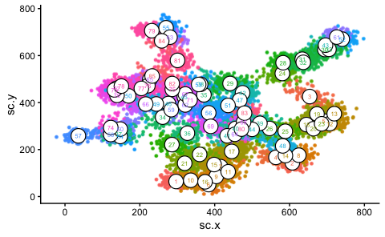
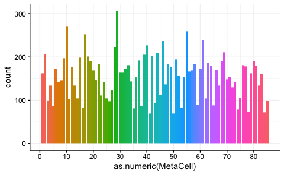
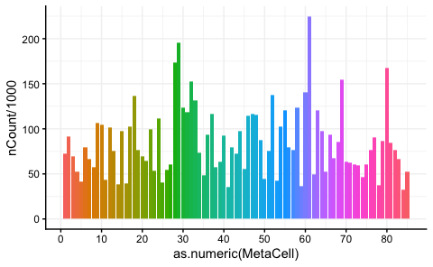
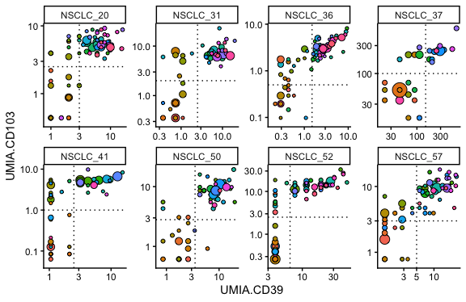
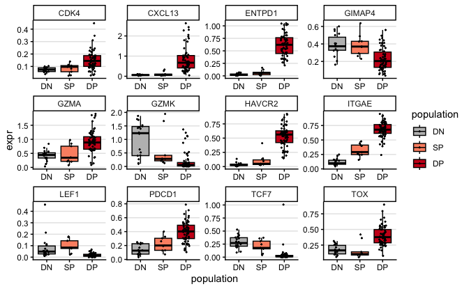
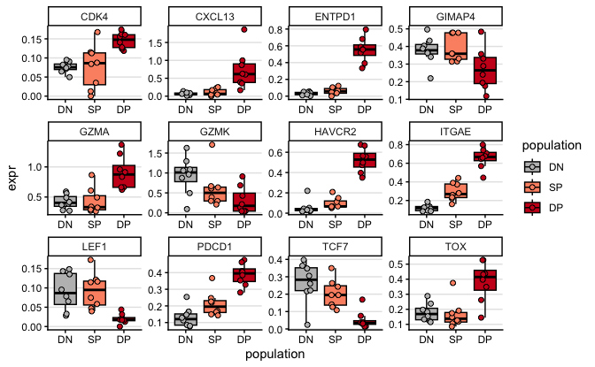

scRNAseq NSCLC population analyses
================
Kaspar Bresser
18/12/2025

- [MetaCell projection and
  composition](#metacell-projection-and-composition)
- [2d projection](#2d-projection)
- [Patient composition](#patient-composition)
- [Define populations](#define-populations)
- [Subset into populations](#subset-into-populations)
- [Gene expression analyses](#gene-expression-analyses)
- [Export files](#export-files)

Below some general visualizations of the scRNAseq data.

``` r
library(Seurat)
library(metacell)
library(tidyverse)
library(lemon)
library(ggrastr)
```

## MetaCell projection and composition

Import the MetaCell object and the 2D coordinates.

``` r
scdb_init("Data")
mc <- scdb_mc("NSCLC_MC_reordered")

str(mc)
```

    ## Formal class 'tgMCCov' [package "metacell"] with 10 slots
    ##   ..@ mc        : Named int [1:13253] 57 37 25 1 28 61 53 28 51 30 ...
    ##   .. ..- attr(*, "names")= chr [1:13253] "S7109_S2_AAACCTGAGATGGCGT" "S7109_S2_AAACCTGAGCTGCAAG" "S7109_S2_AAACCTGAGGGTGTGT" "S7109_S2_AAACCTGAGTCATCCA" ...
    ##   ..@ outliers  : chr [1:128] "S7109_S2_AAATGCCAGCTAAGAT" "S7109_S2_AACCGCGGTCCCGACA" "S7109_S2_ACACCAAGTGGTCTCG" "S7109_S2_ACGCCAGTCTCAACTT" ...
    ##   ..@ cell_names: chr [1:13381] "S7109_S2_AAACCTGAGATGGCGT" "S7109_S2_AAACCTGAGCTGCAAG" "S7109_S2_AAACCTGAGGGTGTGT" "S7109_S2_AAACCTGAGTCATCCA" ...
    ##   ..@ mc_fp     : num [1:16682, 1:85] 1 0.974 0.968 0.988 1 ...
    ##   .. ..- attr(*, "dimnames")=List of 2
    ##   .. .. ..$ : chr [1:16682] "AL627309.5" "LINC01409" "LINC01128" "LINC00115" ...
    ##   .. .. ..$ : chr [1:85] "1" "2" "3" "4" ...
    ##   ..@ e_gc      : num [1:16682, 1:85] 0.00 2.06e-06 5.19e-06 1.03e-06 0.00 ...
    ##   .. ..- attr(*, "dimnames")=List of 2
    ##   .. .. ..$ : chr [1:16682] "AL627309.5" "LINC01409" "LINC01128" "LINC00115" ...
    ##   .. .. ..$ : chr [1:85] "1" "2" "3" "4" ...
    ##   ..@ cov_gc    : num [1:16682, 1:85] 0 0.01235 0.03086 0.00617 0 ...
    ##   .. ..- attr(*, "dimnames")=List of 2
    ##   .. .. ..$ : chr [1:16682] "AL627309.5" "LINC01409" "LINC01128" "LINC00115" ...
    ##   .. .. ..$ : chr [1:85] "1" "2" "3" "4" ...
    ##   ..@ n_bc      : int [1, 1:85] 162 207 99 135 87 172 143 145 197 271 ...
    ##   .. ..- attr(*, "dimnames")=List of 2
    ##   .. .. ..$ : chr "1"
    ##   .. .. ..$ : chr [1:85] "1" "2" "3" "4" ...
    ##   ..@ annots    : Named int [1:85] 28 30 13 19 41 57 75 78 70 34 ...
    ##   .. ..- attr(*, "names")= chr [1:85] "1" "2" "3" "4" ...
    ##   ..@ colors    : Named chr [1:85] "#481769FF" "#3F4889FF" "#38598CFF" "#404588FF" ...
    ##   .. ..- attr(*, "names")= chr [1:85] "1" "2" "3" "4" ...
    ##   ..@ color_key :'data.frame':   0 obs. of  0 variables

``` r
MC.graph <- scdb_mc2d("NSCLC_mc2d_r")

coords <- tibble( cellcode = names(MC.graph@sc_y),
                  sc.x = MC.graph@sc_x,
                  sc.y = MC.graph@sc_y)
coords
```

    ## # A tibble: 13,253 × 3
    ##    cellcode                       sc.x      sc.y
    ##    <chr>                     <dbl[1d]> <dbl[1d]>
    ##  1 S7109_S2_AAACCTGAGATGGCGT      28.3     267. 
    ##  2 S7109_S2_AAACCTGAGCTGCAAG     134.      273. 
    ##  3 S7109_S2_AAACCTGAGGGTGTGT     595.      259. 
    ##  4 S7109_S2_AAACCTGAGTCATCCA     273.       69.2
    ##  5 S7109_S2_AAACCTGAGTGAAGAG     561.      598. 
    ##  6 S7109_S2_AAACCTGCATTGGCGC     737.      700. 
    ##  7 S7109_S2_AAACCTGGTACTCGCG     401.      494. 
    ##  8 S7109_S2_AAACCTGTCCAAACAC     586.      556. 
    ##  9 S7109_S2_AAACCTGTCGACCAGC     463.      365. 
    ## 10 S7109_S2_AAACGGGAGACTTGAA     721.      646. 
    ## # ℹ 13,243 more rows

## 2d projection

Add the MetaCell identities to the coordinate data, and plot the 2D
projection.

Calculate centroids to plot MC ids on top.

``` r
df <- mc@mc %>% 
  enframe(name = "cellcode", value = "MetaCell") %>% 
  inner_join(coords) %>% 
  mutate(MetaCell = as.factor(MetaCell))

# count + centroid per metacell
centroids <- df %>%
  group_by(MetaCell) %>%
  summarise(
    n = n(),
    x = mean(sc.x),
    y = mean(sc.y),
    .groups = "drop"
  )
```

``` r
ggplot(df, aes(x = sc.x, y = sc.y, color = MetaCell)) +
 rasterize( geom_point(size = 0.8), dpi = 600) +
  
  # circle
  geom_point(
    data = centroids,
    aes(x = x, y = y),
    shape = 21,
    size = 6,
    fill = "white",
    color = "black",
    stroke = 0.6
  ) +
  
  # number inside
  geom_text(
    data = centroids,
    aes(x = x, y = y, label = MetaCell),
    size = 2
  ) +
  
  theme_classic() +
  theme(legend.position = "none")
```



``` r
ggsave(filename = "Figs/scRNAseq_2d_proj_MCs_labeled.pdf", width = 6, height = 6)
```

Plot number of cells per MC

``` r
df %>% 
  ggplot(aes(x = as.numeric(MetaCell), fill = MetaCell)) + 
  geom_bar() +
  scale_x_continuous(breaks = seq(0,85,10))+
  theme(legend.position = "none", panel.grid = element_line(color = "grey95"))
```



``` r
ggsave(filename = "Figs/scRNAseq_cellcount_per_MC.pdf", width = 6, height = 2.5)
```

ADT count per MC

``` r
mat.obj <- scdb_mat("NSCLC_filt")

mat.obj@cell_metadata %>% 
  as_tibble(rownames = "cellcode") %>% 
  inner_join(df) %>% 
  group_by(MetaCell) %>% 
  summarise(nCount.reads = sum(nCount_RNA), nCount = sum(nCount_ADT)) %>% 
ggplot(aes(x = as.numeric(MetaCell), fill = MetaCell, y = nCount/1000)) + 
  geom_bar(stat = "identity") +
  scale_x_continuous(breaks = seq(0,85,10))+
  theme(legend.position = "none", panel.grid = element_line(color = "grey95"))
```



``` r
ggsave(filename = "Figs/scRNAseq_ADTcount_per_MC.pdf", width = 6, height = 2.5)
```

## Patient composition

Extract the patient info from the mat object

``` r
mat.obj <- scdb_mat("NSCLC_filt")

mat.obj@cell_metadata %>% 
  select(Patient) %>% 
  as_tibble(rownames = "cellcode") -> patients

patients
```

    ## # A tibble: 13,381 × 2
    ##    cellcode                  Patient 
    ##    <chr>                     <chr>   
    ##  1 S7109_S2_AAACCTGAGATGGCGT NSCLC_52
    ##  2 S7109_S2_AAACCTGAGCTGCAAG NSCLC_41
    ##  3 S7109_S2_AAACCTGAGGGTGTGT NSCLC_52
    ##  4 S7109_S2_AAACCTGAGTCATCCA NSCLC_41
    ##  5 S7109_S2_AAACCTGAGTGAAGAG NSCLC_41
    ##  6 S7109_S2_AAACCTGCATTGGCGC NSCLC_41
    ##  7 S7109_S2_AAACCTGGTACTCGCG NSCLC_52
    ##  8 S7109_S2_AAACCTGTCCAAACAC NSCLC_41
    ##  9 S7109_S2_AAACCTGTCGACCAGC NSCLC_52
    ## 10 S7109_S2_AAACGGGAGACTTGAA NSCLC_41
    ## # ℹ 13,371 more rows

Combine with MetaCells and normalize within samples.

``` r
mc@mc %>% 
  enframe(name = "cellcode", value = "MetaCell") %>% 
  inner_join(patients) %>% 
  count(MetaCell, Patient) %>%
  group_by(Patient)%>%
  mutate(normalized.count = (n/sum(n))*1000 ) %>% 
  mutate(MetaCell = as.factor(MetaCell) ) -> sample.counts.MC

sample.counts.MC
```

    ## # A tibble: 487 × 4
    ## # Groups:   Patient [8]
    ##    MetaCell Patient      n normalized.count
    ##    <fct>    <chr>    <int>            <dbl>
    ##  1 1        NSCLC_20     1            0.456
    ##  2 1        NSCLC_31     1            0.499
    ##  3 1        NSCLC_41   137           66.2  
    ##  4 1        NSCLC_50     5            3.97 
    ##  5 1        NSCLC_52    16           12.1  
    ##  6 1        NSCLC_57     2            1.33 
    ##  7 2        NSCLC_20     8            3.65 
    ##  8 2        NSCLC_31     2            0.999
    ##  9 2        NSCLC_36     3            1.07 
    ## 10 2        NSCLC_37     1           10.4  
    ## # ℹ 477 more rows

## Define populations

I’ll try to define the populations that I sorted on using the CITEseq
hashtag information.

Import the CITEseq information

``` r
mat.obj@cell_metadata %>% 
  as_tibble(rownames = "cellcode") %>% 
  select(cellcode, contains("UMIA")) -> CITE

CITE
```

    ## # A tibble: 13,381 × 9
    ##    cellcode        UMIA.CD4.1 UMIA.CD8 UMIA.CD25 UMIA.CD39 UMIA.CD103 UMIA.CD127
    ##    <chr>                <dbl>    <dbl>     <dbl>     <dbl>      <dbl>      <dbl>
    ##  1 S7109_S2_AAACC…          2      507         1         3         80          0
    ##  2 S7109_S2_AAACC…          2     1414         1         3         94          0
    ##  3 S7109_S2_AAACC…          2      584         2         0          0          7
    ##  4 S7109_S2_AAACC…          5      322         1         0          1          0
    ##  5 S7109_S2_AAACC…          5      897         1         8        125          0
    ##  6 S7109_S2_AAACC…          1      332         5         6         83          0
    ##  7 S7109_S2_AAACC…          8      271         1         1         61          0
    ##  8 S7109_S2_AAACC…          5      299         0         3        117          0
    ##  9 S7109_S2_AAACC…          2      705         3         0        122          0
    ## 10 S7109_S2_AAACG…          4      314         0         3         72          1
    ## # ℹ 13,371 more rows
    ## # ℹ 2 more variables: UMIA.mIgG1 <dbl>, UMIA.PD1 <dbl>

Take the median of each CITEseq antibody per MetaCell

``` r
MC.ids <- enframe(mc@mc, name = "cellcode", value = "MetaCell") %>% mutate(MetaCell = as.character(MetaCell))

CITE %>% 
  inner_join(MC.ids) %>% 
  inner_join(patients) %>% 
  group_by(Patient) %>% 
  mutate(UMIA.CD39 = ((UMIA.CD39+1)/sum(UMIA.CD39))*10000,
         UMIA.CD103 = ((UMIA.CD103+1)/sum(UMIA.CD103))*10000) %>% 
  group_by(MetaCell, Patient) %>% 
  summarise(across(contains("UMIA"), median)) -> average.CITE

average.CITE
```

    ## # A tibble: 487 × 10
    ## # Groups:   MetaCell [85]
    ##    MetaCell Patient  UMIA.CD4.1 UMIA.CD8 UMIA.CD25 UMIA.CD39 UMIA.CD103
    ##    <chr>    <chr>         <dbl>    <dbl>     <dbl>     <dbl>      <dbl>
    ##  1 1        NSCLC_20        6        311       3       0.997     0.439 
    ##  2 1        NSCLC_31        4        254       1       0.733     0.355 
    ##  3 1        NSCLC_41        3        374       1       1.06      0.127 
    ##  4 1        NSCLC_50        3        380       0       1.72      0.613 
    ##  5 1        NSCLC_52        3.5      449       2       3.86      0.392 
    ##  6 1        NSCLC_57        2        395       0.5     2.11      2.36  
    ##  7 10       NSCLC_20        4.5      263       3       0.997     1.54  
    ##  8 10       NSCLC_31        5        492       4       1.10      0.355 
    ##  9 10       NSCLC_41        2        370       1       1.06      0.0633
    ## 10 10       NSCLC_50        5        437       0       2.59      0.613 
    ## # ℹ 477 more rows
    ## # ℹ 3 more variables: UMIA.CD127 <dbl>, UMIA.mIgG1 <dbl>, UMIA.PD1 <dbl>

``` r
sample.counts.MC %>% 
  mutate(MetaCell = (MetaCell)) %>% 
  inner_join(average.CITE) -> for.plot
```

Visualize per patient, and set some cutoffs

``` r
cutoffs <- tibble(Patient = unique(for.plot$Patient),
                   CD39 = c(3, 2.5, 2.5, 3.5, 6.5, 5, 1.5, 150),
                   CD103 = c(2.5, 2, 1, 2.8, 2.5, 3, 0.5, 100))
```

Plot

``` r
for.plot %>% 
#  filter(Patient != "NSCLC_37") %>% 
  mutate(Patient = factor(Patient, levels = unique(for.plot$Patient))) %>% 
  ggplot(aes(x = UMIA.CD39, y = UMIA.CD103))+
  geom_point(aes(size = normalized.count, fill = as.character(MetaCell)), shape = 21, color = "black")+
  facet_rep_wrap(~Patient, nrow = 2, repeat.tick.labels = T, scales = "free")+
  theme_classic()+
  scale_y_log10(expand = expansion(mult = c(0.1, .05)))+
  scale_x_log10(expand = expansion(mult = c(0.1, .05)))+
  geom_hline(data = cutoffs, aes(yintercept = CD103), linetype = "dotted")+
  geom_vline(data = cutoffs, aes(xintercept = CD39), linetype = "dotted")+
  theme(legend.position = "none")
```

    ## Warning: `facet_rep_wrap` and `facet_rep_lab` have been soft-deprecated. A
    ## replacement can be found in ggh4x::facet_wrap2.



``` r
ggsave(filename = "Figs/Populations_definition.pdf", width = 11, height = 6, useDingbats = F, scale = .5)
```

## Subset into populations

Based on the cutoffs, divide the cells from each MC to the DN, SP, DP
populations. Do this for each patient.

``` r
for.plot %>% 
  select(MetaCell, Patient, n, UMIA.CD39, UMIA.CD103) %>% 
  pivot_longer(cols = c(UMIA.CD39, UMIA.CD103)) %>% 
  mutate(name = str_remove(name, "UMIA\\.")) %>% 
  inner_join(pivot_longer(cutoffs, cols = c(CD39, CD103), names_to = "name", values_to = "cutoff")) %>% 
  mutate(tmp = value > cutoff) %>% 
  group_by(MetaCell, Patient, n) %>% 
  summarise(population = sum(tmp)) %>%
  mutate(population = case_when(population == 0 ~ "DN",
                                population == 1 ~ "SP",
                                population == 2 ~ "DP")) -> MC.populations
```

If a MC could be in multiple populations across the patients, assign it
to the dominant population.

``` r
MC.populations %>% 
  group_by(MetaCell, population) %>% 
  summarise(n = sum(n)) %>% 
  group_by(MetaCell) %>% 
  reframe(n.prop = n/sum(n), population = population) %>% 
  group_by(MetaCell) %>% 
  slice_max(n.prop, n=1) %>% 
  select(MetaCell, population) -> population.id
```

## Gene expression analyses

Import Seurat object and Normalize the data

``` r
seurat.obj <- read_rds("Data/CD8_NSCLC_filt.rds")
seurat.obj <- NormalizeData(seurat.obj, assay = "RNA", normalization.method = "CLR")
```

    ## Warning in asMethod(object): sparse->dense coercion: allocating vector of size
    ## 3.1 GiB

Define function to extract counts per gene per cellcode from the seurat
object

``` r
get_expression <- function(gene.list){
  
 seurat.obj %>% 
  GetAssayData( layer = "data", assay = "RNA")%>% 
  t() %>% 
  as.data.frame() %>% 
  as_tibble(rownames = "cellcode") %>% 
  select(one_of(c("cellcode", gene.list)))
  
}
```

Define Immune related genes

``` r
imm.genes <- c('ITGAE', 'ENTPD1','CXCL13', "CDK4", 'LEF1', 'GZMA', 'TOX','PDCD1', 'HAVCR2', 'TCF7', 'GZMK', "GIMAP4" )
```

Get expression of these genes.

``` r
expression.data <- get_expression(imm.genes)
```

Plot their expression across the populations. Dots are MCs in this one.

``` r
expression.data %>% 
  inner_join(MC.ids) %>% 
  inner_join(population.id) %>% 
  pivot_longer(cols = all_of(imm.genes), names_to = "gene", values_to = "norm_umi") %>% 
  group_by(gene, MetaCell, population) %>% 
  summarise(expr = mean(norm_umi)) %>% 
  mutate(population = factor(population, levels = c("DN", "SP", "DP"))) %>% 
ggplot(aes(x= population, y = expr, fill = population))+
  geom_boxplot(outlier.shape = NA, color ="black")+
  geom_jitter(width = 0.15, size = 0.33)+
  facet_rep_wrap(~gene, scales = "free")+
  scale_fill_manual(values = c("grey", "#fc9272","#cb181d"))+
  theme(panel.grid.major.y = element_line(color = "grey90"))
```

    ## Warning: `facet_rep_wrap` and `facet_rep_lab` have been soft-deprecated. A
    ## replacement can be found in ggh4x::facet_wrap2.



``` r
ggsave(filename = "Figs/scRNAseq_Populations_ImmGene_perMC.pdf", width = 6, height = 4, useDingbats=FALSE)
```

Plot their expression across the populations. Dots are Patients in this
one.

``` r
expression.data %>% 
  inner_join(MC.ids) %>% 
  inner_join(population.id) %>% 
  inner_join(patients) %>% 
  pivot_longer(cols = all_of(imm.genes), names_to = "gene", values_to = "norm_umi") %>% 
  group_by(gene, Patient, population) %>% 
  summarise(expr = mean(norm_umi)) %>% 
  mutate(population = factor(population, levels = c("DN", "SP", "DP"))) %>% 
ggplot(aes(x= population, y = expr, fill = population))+
  geom_boxplot(outlier.shape = NA, color ="black")+
  geom_jitter(width = 0.15, size = 1.75, shape = 21)+
  facet_rep_wrap(~gene, scales = "free")+
  scale_fill_manual(values = c("grey", "#fc9272","#cb181d"))+
  theme(panel.grid.major.y = element_line(color = "grey90"))
```

    ## Warning: `facet_rep_wrap` and `facet_rep_lab` have been soft-deprecated. A
    ## replacement can be found in ggh4x::facet_wrap2.



``` r
ggsave(filename = "Figs/scRNAseq_Populations_ImmGene_perPatient.pdf", width = 6, height = 4, useDingbats=FALSE)
```

## Export files

Export population identity of MetaCells

``` r
expression.data %>% 
  inner_join(MC.ids) %>% 
  inner_join(population.id) %>% 
  inner_join(patients) %>% 
  select(-c(imm.genes)) %>% 
  write_tsv("Output/scRNAseq_population_per_cellcode.tsv")
```

    ## Warning: Using an external vector in selections was deprecated in tidyselect 1.1.0.
    ## ℹ Please use `all_of()` or `any_of()` instead.
    ##   # Was:
    ##   data %>% select(imm.genes)
    ## 
    ##   # Now:
    ##   data %>% select(all_of(imm.genes))
    ## 
    ## See <https://tidyselect.r-lib.org/reference/faq-external-vector.html>.
    ## This warning is displayed once per session.
    ## Call `lifecycle::last_lifecycle_warnings()` to see where this warning was
    ## generated.

Export pseudobulked data across populations

``` r
seurat.obj %>% 
  GetAssayData( layer = "counts", assay = "RNA")%>% 
  t() %>% 
  as.data.frame() %>% 
  as_tibble(rownames = "cellcode") %>% 
  inner_join(MC.ids) %>% 
  inner_join(population.id) %>% 
  inner_join(patients) -> all.expr.data
```

    ## Warning in asMethod(object): sparse->dense coercion: allocating vector of size
    ## 3.1 GiB

``` r
all.expr.data %>% 
  pivot_longer(cols = all_of(seurat.obj@assays[["RNA"]]@counts@Dimnames[[1]]), names_to = "gene", values_to = "count") %>% 
  group_by(gene, Patient, population) %>% 
  summarise(count = sum(count)) -> all.expr.data
```

``` r
write_tsv(all.expr.data, "Output/scRNAseq_pseudobulked_readcounts.tsv")
```
