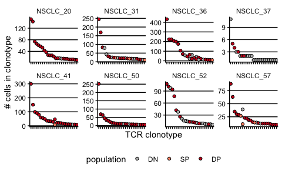
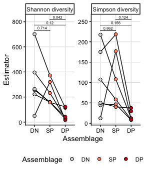

scRNAseq NSCLC TCR clonality
================
Kaspar Bresser
18/01/2024

- [import data](#import-data)
- [iNEXT](#inext)

Below some analysis regarding TCR clonality in the NSCLC scRNAseq data.

## import data

``` r
scdb_init("Data")
```

Import mat object (MetaCell)

``` r
mat.obj <- scdb_mat("NSCLC_filt")
```

Import Patient/cellcode/population info

``` r
population.MC.ids <- read_tsv("Output/scRNAseq_population_per_cellcode.tsv")
```

combine data

``` r
library(tidytext)

mat.obj@cell_metadata %>% 
  as_tibble(rownames = "cellcode") %>% 
  select(cellcode, clonotype_id) %>% 
  inner_join(population.MC.ids) %>% 
  na.omit() %>% 
  mutate(clonotype_id = paste0(clonotype_id)) %>% 
  count(population, Patient, clonotype_id) %>% 
  ungroup() -> TCR.counts

write_tsv(TCR.counts, "Output/scRNAseq_TCR_clonotypes.tsv")
```

``` r
TCR.counts %>% 
  group_by(Patient) %>% 
  slice_max(n, n = 25, with_ties = F) %>% 
  mutate(population = factor(population, levels = c("DN", "SP", "DP"))) %>% 
ggplot(aes(x = reorder_within(clonotype_id, -n, Patient), y = n, fill = population))+
  geom_point(shape =21)+
  facet_wrap(~Patient, scales = "free", nrow = 2)+
  theme( axis.text.x = element_blank(), legend.position = "bottom", 
         panel.grid.major.y = element_line(), strip.background = element_blank())+
  scale_fill_manual(values = c("grey", "#fc9272","#cb181d"))+
  labs(x = "TCR clonotype", y = "# cells in clonotype")
```



``` r
ggsave(filename = "Figs/scRNAseq_TCRclonality_top25.pdf", width = 8, height = 5, useDingbats = F, scale = .65)
```

## iNEXT

use the iNEXT package to calculate TCR diversity

``` r
TCR.counts %>% 
  nest(data = -Patient) %>% 
  mutate(data = map(data, ~pivot_wider(., names_from = population, values_from = n, values_fill = 0))) %>% 
  mutate(data = map(data, ~column_to_rownames(., "clonotype_id"))) %>% 
  mutate(data = map(data, ~iNEXT(., endpoint = 1000))) %>% 
  mutate(data = map(data, "AsyEst")) %>% 
  unnest(data) -> iNEXT.output

write_tsv(iNEXT.output, "Output/scRNAseq_iNEXT_TCRdiversity.tsv")
```

Plot output. NSCLC_37 is excluded due to its low depth.

``` r
iNEXT.output %>% 
  filter(Patient != "NSCLC_37" & Patient != "NSCLC_52") %>% 
  filter(Diversity != "Species richness") %>% 
  mutate(Assemblage = factor(Assemblage, levels = c("DN", "SP", "DP"))) %>% 
  group_by(Diversity) %>% 
  t_test(Estimator~Assemblage,  paired = T) %>% 
  add_xy_position(scales = "free", x = "Assemblage", step.increase = .05) %>% 
  adjust_pvalue()-> stats.test

iNEXT.output %>% 
  filter(Patient != "NSCLC_37" & Patient != "NSCLC_52") %>% 
  filter(Diversity != "Species richness") %>% 
  mutate(Assemblage = factor(Assemblage, levels = c("DN","SP", "DP"))) %>% 
  ggplot(aes(x = Assemblage, y = Estimator))+
  geom_line(aes(group = Patient))+
  geom_point(shape = 21, size = 2, aes( fill = Assemblage))+
  facet_wrap(~Diversity, scales = "free")+
    scale_fill_manual(values = c("grey85", "#fc9272","#cb181d"))+
  theme(panel.grid.major = element_line(color = "grey90"), legend.position = "bottom")+
  stat_pvalue_manual(data = stats.test,  label = "p.adj", 
                     tip.length = 0, hide.ns = F, label.size = 2)
```



``` r
ggsave(filename = "Figs/TCRdiversity2.pdf", width = 3, height = 3, useDingbats = F)
```
