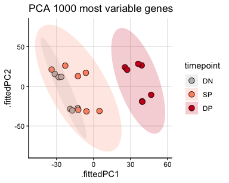
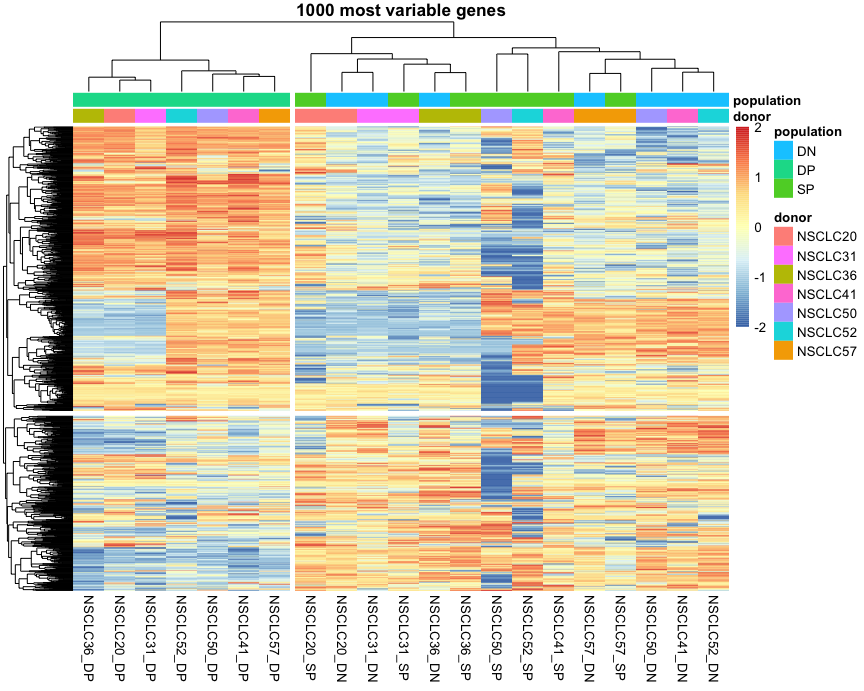
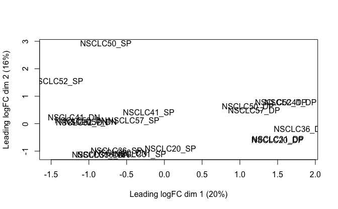
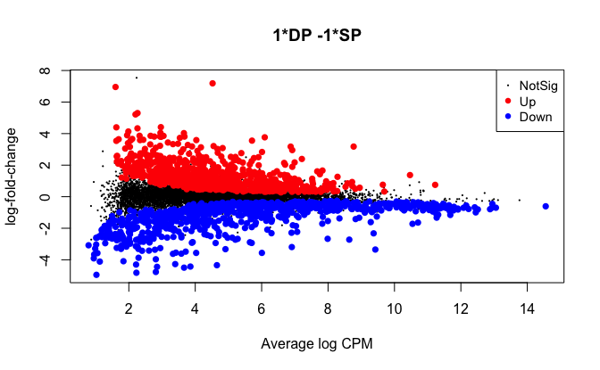
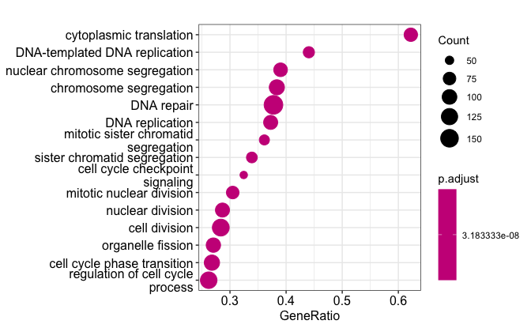
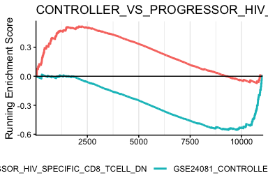
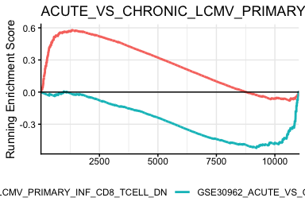
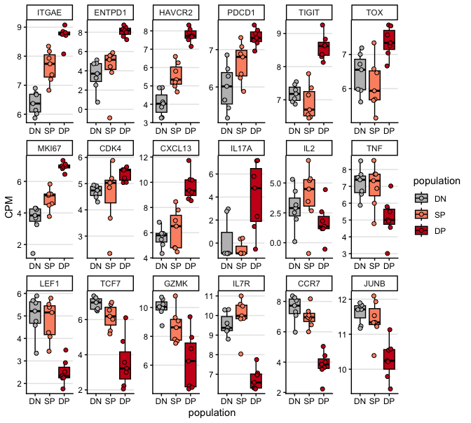

DE testing
================
Kaspar Bresser

- [Import and inspect](#import-and-inspect)
- [PCA](#pca)
- [DE analysis - edgeR](#de-analysis---edger)
- [GSEA](#gsea)
- [plot genes](#plot-genes)

## Import and inspect

Import reads

``` r
read.counts <- read_tsv( "Output/scRNAseq_pseudobulked_readcounts.tsv") %>% mutate(Patient = str_remove(Patient, "_"))
```

pivot to wide data

``` r
read.counts %>% 
 # filter(population != "DN") %>% 
  filter(Patient != "NSCLC37") %>% 
  pivot_wider(names_from = c(Patient, population), values_from = count) -> read.counts.wide
```

Generate DGE object

``` r
DGE.object <- DGEList(counts = read.counts.wide[2:22], 
                      genes = pull(read.counts.wide, gene))
```

Filter low expression

``` r
countsPerMillion <- as.data.frame(cpm(DGE.object), row.names =  pull(read.counts.wide, gene))

thresh <- countsPerMillion > 4
table(rowSums(thresh))
```

    ## 
    ##     0     1     2     3     4     5     6     7     8     9    10    11    12 
    ## 18035  1460   456   300   237   204   176   195   157   177   161   149   180 
    ##    13    14    15    16    17    18    19    20    21 
    ##   132   173   169   182   217   256   378   776  7349

``` r
summary(rowSums(thresh) >= 5)
```

    ##    Mode   FALSE    TRUE 
    ## logical   20488   11031

extract CPM

``` r
DGE.object <- DGE.object[rowSums(thresh) >= 5, , keep.lib.sizes=FALSE]
DGE.object <- calcNormFactors(DGE.object)

countsPerMillion <- as.data.frame(cpm(DGE.object, normalized.lib.sizes = T, log = T), 
                                  row.names = DGE.object$genes$genes)
```

## PCA

get variance

``` r
var_genes <- apply(countsPerMillion, 1, var)
head(var_genes)
```

    ##      A1BG  A1BG-AS1       A2M   A2M-AS1      AAAS      AACS 
    ## 0.2299700 0.1853111 3.8265399 2.1786747 0.1305588 1.2651229

select top 1,000, perform PCA

``` r
select_var <- names(sort(var_genes, decreasing=TRUE))[1:1000]
countsPerMillion <- countsPerMillion[select_var, ]

countsPerMillion %>% 
  t() %>% 
  as.data.frame() %>% 
  prcomp(center = T, scale = F) -> pca

str(pca)
```

    ## List of 5
    ##  $ sdev    : num [1:21] 28 23.4 17.7 15.5 11.3 ...
    ##  $ rotation: num [1:1000, 1:21] 0.015 -0.0305 -0.0204 -0.0267 -0.0551 ...
    ##   ..- attr(*, "dimnames")=List of 2
    ##   .. ..$ : chr [1:1000] "HLA-DQA2" "AP001011.1" "AC009313.1" "TRBV24-1" ...
    ##   .. ..$ : chr [1:21] "PC1" "PC2" "PC3" "PC4" ...
    ##  $ center  : Named num [1:1000] 4.63 2.75 2.72 2.69 1.91 ...
    ##   ..- attr(*, "names")= chr [1:1000] "HLA-DQA2" "AP001011.1" "AC009313.1" "TRBV24-1" ...
    ##  $ scale   : logi FALSE
    ##  $ x       : num [1:21, 1:21] -12.9 39.3 4.7 -19 39.5 ...
    ##   ..- attr(*, "dimnames")=List of 2
    ##   .. ..$ : chr [1:21] "NSCLC20_DN" "NSCLC20_DP" "NSCLC20_SP" "NSCLC31_DN" ...
    ##   .. ..$ : chr [1:21] "PC1" "PC2" "PC3" "PC4" ...
    ##  - attr(*, "class")= chr "prcomp"

Plot PCA

``` r
pca %>% 
  augment() %>% 
  separate(.rownames, into = c("Patient", "population")) %>% 
  mutate(population = factor(population, levels = c("DN", "SP", "DP"))) %>% 
ggplot(aes(x = .fittedPC1, y = .fittedPC2))+
  geom_point( size = 3, shape = 21, aes( fill = population))+
     stat_ellipse(geom = "polygon",
               aes(fill = paste( population)), 
               alpha = .2)+
  scale_fill_manual(values = c("grey", "#fc9272","#cb181d"))+
  ggtitle("PCA 1000 most variable genes")+
  theme_classic()+
  theme(panel.grid.major = element_line(color = "grey90"))+
  guides(fill = guide_legend("timepoint", override.aes = list(shape = 21)))
```



Plot heatmap

``` r
select_var <- names(sort(var_genes, decreasing=TRUE))[1:1000]
countsPerMillion <- countsPerMillion[select_var,]

as.data.frame(pca$x) %>% 
  rownames_to_column("sample") %>% 
  separate(sample, into = c("donor", "population"), remove = F) %>% 
  dplyr::select(sample, donor,  population) %>% 
#  filter(population != "GFPpos") %>% 
  column_to_rownames("sample") -> annotation

annotation
```

    ##              donor population
    ## NSCLC20_DN NSCLC20         DN
    ## NSCLC20_DP NSCLC20         DP
    ## NSCLC20_SP NSCLC20         SP
    ## NSCLC31_DN NSCLC31         DN
    ## NSCLC31_DP NSCLC31         DP
    ## NSCLC31_SP NSCLC31         SP
    ## NSCLC36_DN NSCLC36         DN
    ## NSCLC36_DP NSCLC36         DP
    ## NSCLC36_SP NSCLC36         SP
    ## NSCLC41_DN NSCLC41         DN
    ## NSCLC41_DP NSCLC41         DP
    ## NSCLC41_SP NSCLC41         SP
    ## NSCLC50_DN NSCLC50         DN
    ## NSCLC50_DP NSCLC50         DP
    ## NSCLC50_SP NSCLC50         SP
    ## NSCLC52_DN NSCLC52         DN
    ## NSCLC52_DP NSCLC52         DP
    ## NSCLC52_SP NSCLC52         SP
    ## NSCLC57_DN NSCLC57         DN
    ## NSCLC57_DP NSCLC57         DP
    ## NSCLC57_SP NSCLC57         SP

``` r
library(pheatmap)

countsPerMillion %>% 
#  select(!contains("GFPpos")) %>% 
pheatmap(scale = "row",breaks = seq(-2,2,by=0.04), 
         clustering_distance_cols = "correlation" , 
         annotation_col = annotation, show_rownames = F,
         border_color = NA, clustering_distance_rows = "euclidean", 
         main = "1000 most variable genes", cutree_cols = 2, cutree_rows = 2)
```



## DE analysis - edgeR

Set up design

``` r
DGE.object$group <- rep(c("DN", "DP", "SP"), 7)
g <- factor((DGE.object$group))


# Set design for comparison
design <- model.matrix(~ 0 + g)
colnames(design) <- levels(g)

design
```

    ##    DN DP SP
    ## 1   1  0  0
    ## 2   0  1  0
    ## 3   0  0  1
    ## 4   1  0  0
    ## 5   0  1  0
    ## 6   0  0  1
    ## 7   1  0  0
    ## 8   0  1  0
    ## 9   0  0  1
    ## 10  1  0  0
    ## 11  0  1  0
    ## 12  0  0  1
    ## 13  1  0  0
    ## 14  0  1  0
    ## 15  0  0  1
    ## 16  1  0  0
    ## 17  0  1  0
    ## 18  0  0  1
    ## 19  1  0  0
    ## 20  0  1  0
    ## 21  0  0  1
    ## attr(,"assign")
    ## [1] 1 1 1
    ## attr(,"contrasts")
    ## attr(,"contrasts")$g
    ## [1] "contr.treatment"

``` r
# Estimate dispersions
DGE.object <- estimateDisp(DGE.object, design, robust=TRUE)

plotMDS(DGE.object)
```



estimate fit, and test for DP versus SP contrast

``` r
fit <- glmQLFit(DGE.object, design)

my.contrasts <- makeContrasts(DPvSP = DP-SP, levels=design)


qlf <- glmQLFTest(fit, contrast = my.contrasts[,"DPvSP"])

plotMD(qlf)
```



extract and output results

``` r
qlf$table %>% 
  as_tibble() %>% 
  mutate(gene = DGE.object$genes$genes) %>% 
  mutate(FDR = p.adjust(PValue, method = "fdr")) -> DE.results

DE.results
```

    ## # A tibble: 11,031 × 6
    ##       logFC logCPM         F   PValue gene         FDR
    ##       <dbl>  <dbl>     <dbl>    <dbl> <chr>      <dbl>
    ##  1 -0.751     5.55 15.8      0.000621 A1BG     0.00848
    ##  2 -0.00385   2.80  0.000191 0.989    A1BG-AS1 0.999  
    ##  3 -2.61      2.31  6.95     0.0150   A2M      0.0838 
    ##  4 -2.34      1.75 12.4      0.00189  A2M-AS1  0.0192 
    ##  5  0.223     4.01  1.26     0.274    AAAS     0.531  
    ##  6 -0.183     2.64  0.334    0.569    AACS     0.786  
    ##  7  0.267     4.83  1.96     0.175    AAGAB    0.411  
    ##  8 -0.208     6.92  2.06     0.165    AAK1     0.398  
    ##  9 -0.757     3.21  5.08     0.0344   AAMDC    0.147  
    ## 10  0.0366    5.66  0.117    0.923    AAMP     0.985  
    ## # ℹ 11,021 more rows

``` r
write_tsv(DE.results, "Output/scRNAseq_DE_results.tsv")
```

## GSEA

Set up gene list

``` r
gene.list <- DE.results %>%
  arrange(desc(logFC)) %>%
  mutate(ENTREZID = mapIds(org.Hs.eg.db,
                           keys = gene,
                           keytype = "SYMBOL",
                           column = "ENTREZID")) %>%
  filter(!is.na(ENTREZID)) %>%
  dplyr::select(ENTREZID, logFC)

# Named numeric vector for GSEA
gene.list.vec <- gene.list$logFC
names(gene.list.vec) <- gene.list$ENTREZID
```

run GSEA on Biological Process (GO)

``` r
gsea.res <- gseGO(
  geneList = sort(gene.list.vec, decreasing = TRUE),
  OrgDb = org.Hs.eg.db,
  ont = "BP",
  keyType = "ENTREZID",
  pvalueCutoff = 0.05
)
```

    ## Warning in fgseaMultilevel(...): For some pathways, in reality P-values are
    ## less than 1e-10. You can set the `eps` argument to zero for better estimation.

``` r
dotplot(gsea.res, showCategory = 15)
```

    ## Warning: `aes_string()` was deprecated in ggplot2 3.0.0.
    ## ℹ Please use tidy evaluation idioms with `aes()`.
    ## ℹ See also `vignette("ggplot2-in-packages")` for more information.
    ## ℹ The deprecated feature was likely used in the enrichplot package.
    ##   Please report the issue at
    ##   <https://github.com/GuangchuangYu/enrichplot/issues>.
    ## This warning is displayed once per session.
    ## Call `lifecycle::last_lifecycle_warnings()` to see where this warning was
    ## generated.



Check ImmuneSigDB

``` r
library(msigdbr)

# Get human immunologic signatures
m.t2 <- msigdbr(species = "Homo sapiens", collection = "C7")

# Convert to list for clusterProfiler
m.t2 <-  m.t2[, c("gs_name", "gene_symbol")]


# Keep only pathways containing "TCELL"
m.t2 <- m.t2 %>%
  filter(grepl("TCELL", gs_name, ignore.case = TRUE))


gene.list.vec <- DE.results$logFC
names(gene.list.vec) <- DE.results$gene
gene.list.vec <- sort(gene.list.vec, decreasing = TRUE)

# Run GSEA
gsea.res <- GSEA(
  geneList = gene.list.vec, # logFC ranked
  TERM2GENE = m.t2,
  pvalueCutoff = 0.05
)
```

    ## Warning in fgseaMultilevel(...): For some pathways, in reality P-values are
    ## less than 1e-10. You can set the `eps` argument to zero for better estimation.

Then plot individual pathways

``` r
library(enrichplot)
gseaplot2(gsea.res, geneSetID = c("GSE24081_CONTROLLER_VS_PROGRESSOR_HIV_SPECIFIC_CD8_TCELL_DN",
                                  "GSE24081_CONTROLLER_VS_PROGRESSOR_HIV_SPECIFIC_CD8_TCELL_UP"), 
          title = "CONTROLLER_VS_PROGRESSOR_HIV_SPECIFIC_CD8_TCEL", pvalue_table = F,
          subplots = 1)+
  geom_hline(yintercept = 0, linetype = "solid")+
  theme(legend.position = "bottom")
```

    ## Warning: `aes_()` was deprecated in ggplot2 3.0.0.
    ## ℹ Please use tidy evaluation idioms with `aes()`
    ## ℹ The deprecated feature was likely used in the enrichplot package.
    ##   Please report the issue at
    ##   <https://github.com/GuangchuangYu/enrichplot/issues>.
    ## This warning is displayed once per session.
    ## Call `lifecycle::last_lifecycle_warnings()` to see where this warning was
    ## generated.

    ## Warning: Using `size` aesthetic for lines was deprecated in ggplot2 3.4.0.
    ## ℹ Please use `linewidth` instead.
    ## ℹ The deprecated feature was likely used in the enrichplot package.
    ##   Please report the issue at
    ##   <https://github.com/GuangchuangYu/enrichplot/issues>.
    ## This warning is displayed once per session.
    ## Call `lifecycle::last_lifecycle_warnings()` to see where this warning was
    ## generated.



``` r
ggsave("Figs/scRNAseq_DPvsSP_HIV.pdf", width = 5, height = 4)
```

``` r
gseaplot2(gsea.res, geneSetID = c("GSE30962_ACUTE_VS_CHRONIC_LCMV_PRIMARY_INF_CD8_TCELL_DN",
                                  "GSE30962_ACUTE_VS_CHRONIC_LCMV_PRIMARY_INF_CD8_TCELL_UP"), 
          title = "ACUTE_VS_CHRONIC_LCMV_PRIMARY_INF_CD8_TCELL", pvalue_table = F,
          subplots = c(1))+
  geom_hline(yintercept = 0, linetype = "solid")+
  theme(legend.position = "bottom", panel.grid.major.y = element_line())
```



``` r
ggsave("Figs/scRNAseq_DPvsSP_LCMV.pdf", width = 5, height = 4)
```

## plot genes

``` r
dat.cpm <- as.data.frame(cpm(DGE.object, normalized.lib.sizes = T, log = T), 
                                  row.names = DGE.object$genes$genes) %>% as_tibble(rownames = "gene")
```

``` r
imm.genes <- c('ITGAE', 'ENTPD1',  'HAVCR2', 'PDCD1', "TIGIT", 'TOX',
               "MKI67", "CDK4",'CXCL13', "IL17A", "IL2", "TNF",
                "LEF1", 'TCF7','GZMK', "IL7R", "CCR7", "JUNB" )

dat.cpm %>% 
  filter(gene %in% imm.genes) %>% 
  pivot_longer(-gene, names_to = "sample", values_to = "CPM") %>% 
  separate(sample, into = c("Patient", "population")) %>% 
  mutate(population = factor(population, levels = c("DN", "SP", "DP"))) %>% 
  mutate(gene = factor(gene, levels = imm.genes)) %>% 
ggplot(aes(x= population, y = CPM, fill = population))+
  geom_boxplot(outlier.shape = NA, color ="black")+
  geom_jitter(width = 0.15, size = 1.75, shape = 21)+
  facet_rep_wrap(~gene, scales = "free", nrow =3)+
  scale_fill_manual(values = c("grey", "#fc9272","#cb181d"))+
  theme_classic()+
  theme(panel.grid.major.y = element_line(color = "grey90"))
```

    ## Warning: `facet_rep_wrap` and `facet_rep_lab` have been soft-deprecated. A
    ## replacement can be found in ggh4x::facet_wrap2.



``` r
ggsave("Figs/scRNAseq_examples_pseudobulk.pdf", width = 7, height = 5)
```
