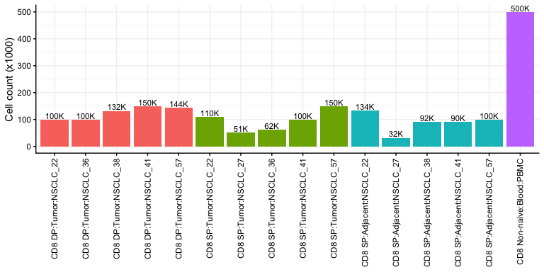
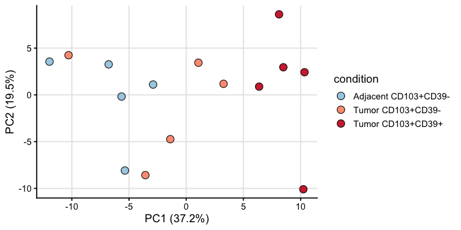
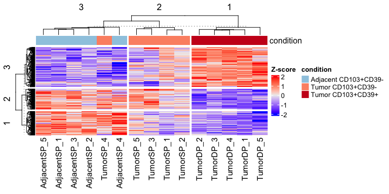
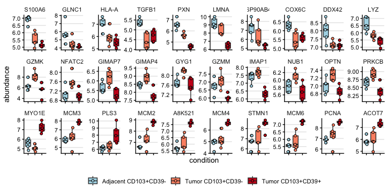
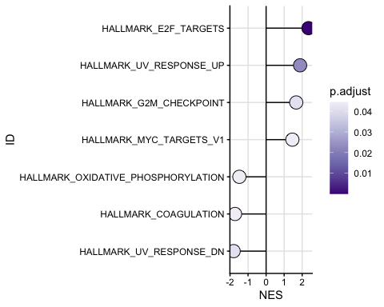
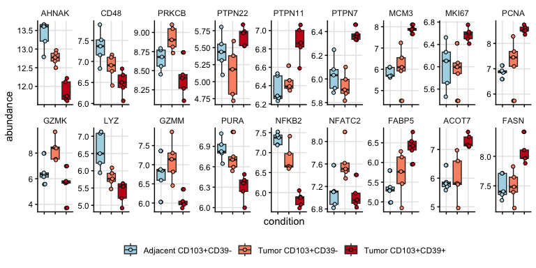
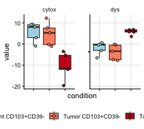

TMT16 LC-MS initial analysis
================
Kaspar Bresser
2025-04-11

- [plot cell numbers](#plot-cell-numbers)
- [Import and clean-up](#import-and-clean-up)
- [PCA](#pca)
- [DE protein](#de-protein)
- [Heatmap DE](#heatmap-de)
- [Cluster analysis](#cluster-analysis)
- [Output clusters](#output-clusters)
- [GSEA](#gsea)
- [Example boxplots](#example-boxplots)
- [Dysfunction and cytotoxicity
  signatures](#dysfunction-and-cytotoxicity-signatures)

LC-MS analysis Figure 1

``` r
library(DEP)
library(lemon)
library(msigdbr)
library(fgsea)
library(pheatmap)
library(tidyverse)
library(ggpmisc)
library(ggrepel)
library(ggpubr)
library(limma)
library(ComplexHeatmap)
library(circlize)
library(clusterProfiler)
library(ReactomePA)
library(org.Hs.eg.db)
library(scales)
```

## plot cell numbers

Number of cells sorted per population

``` r
read_tsv("Data_LCMS/TIL_samples.txt") %>% 
  mutate(
    pop = fct_cross(Population, Origin),
    pop = factor(pop, levels = c(
      "CD8 DP:Tumor", "CD8 SP:Tumor", "CD8 SP:Adjacent", "CD8 Non-naive:Blood"
    )),
    sample = fct_cross(pop, Sample),
    cell_label = label_number(scale = 1/1000, suffix = "K", accuracy = 1)(`Cell #`)
  ) %>% 
  ggplot(aes(x = sample, y = `Cell #` / 1000, fill = pop)) + 
  geom_bar(stat = "identity") +
  geom_text(aes(label = cell_label), vjust = -0.2, size = 3) +
  theme_classic() +
  theme(
    legend.position = "none",
    panel.grid = element_line(color = "grey95"),
    axis.text.x = element_text(angle = 90, vjust = 0.5, hjust = 1)
  ) +
  labs(y = "Cell count (x1000)", x = NULL)
```



``` r
ggsave("Figs/LCMS_cellcounts.pdf", width = 8, height = 5)
```

## Import and clean-up

Import the data, some uniprot identifiers need to be updated, these are
in the ‘conversion.txt’ file

``` r
protein.table.CD8 <- read_tsv("Data_LCMS/LCMS_NSCLC_CD8.tsv")

read_tsv("Data_LCMS/conversion.txt") %>% 
  dplyr::select(new, old) %>% 
  na.omit() %>% 
  full_join(protein.table.CD8, by = c("old" = "name")) %>% 
  mutate(gene.name = case_when(is.na(new) ~ old, TRUE ~ new)) %>%
  dplyr::select(gene.name, condition, sample, abundance) %>% 
  group_by(gene.name, sample, condition) %>% 
  summarise(abundance = mean(abundance)) %>% 
  ungroup() -> protein.table.CD8
```

## PCA

Select the 150 Most Variable Proteins

``` r
# Compute variance per protein and select top 150
top.proteins <- protein.table.CD8 %>%
  group_by(gene.name) %>%
  summarise(var_abundance = var(abundance, na.rm = TRUE)) %>%
  arrange(desc(var_abundance)) %>%
  slice_head(n = 150) %>%
  pull(gene.name)
```

``` r
# Prepare the wide log2 abundance matrix for PCA
pca.mat <- protein.table.CD8 %>%
  filter(condition != "Non-naive CD8") %>% 
  dplyr::select(-condition) %>% 
  filter(gene.name %in% top.proteins) %>%  # top_proteins from heatmap step
  pivot_wider(names_from = sample, values_from = abundance) %>%
  column_to_rownames("gene.name") %>%
  as.matrix() %>%
  t() # transpose so samples are rows

# Perform PCA
pca.res <- prcomp(pca.mat, scale. = TRUE)


condition.df <- protein.table.CD8 %>%
  distinct(sample, condition) %>%
  column_to_rownames("sample")

# Prepare PCA dataframe
pca.df <- as.data.frame(pca.res$x) %>%
  rownames_to_column("sample") %>%
  left_join(condition.df %>% rownames_to_column("sample"), by = "sample")

# Variance explained
percentVar <- round(100 * (pca.res$sdev^2 / sum(pca.res$sdev^2)), 1)

# Plot PCA
ggplot(pca.df, aes(x = PC1, y = PC2, fill = condition)) +
  geom_point(shape = 21, size = 4, alpha = 0.9, color ="black") +
  scale_fill_manual(values = c(
      "Adjacent CD103+CD39-" = "#9ecae1",
      "Tumor CD103+CD39-" = "#fc9272",
      "Tumor CD103+CD39+" = "#cb181d")) +
  labs(x = paste0("PC1 (", percentVar[1], "%)"),
    y = paste0("PC2 (", percentVar[2], "%)"),
    color = "Condition") +
  theme_classic(base_size = 14) +
  theme(panel.grid.major = element_line(color = "grey90"),
    legend.position = "right")
```



``` r
ggsave("Figs/LCMS_PCA.pdf", width = 5.5, height = 3)
```

## DE protein

First construct a dataframe containing the samples and conditions

``` r
protein.table.CD8 %>% 
  filter(condition != "Non-naive CD8") %>%   
  mutate(condition = case_when(
    condition == "Tumor CD103+CD39+" ~ "CD39pos", 
    condition == "Tumor CD103+CD39-" ~ "CD39neg",
    TRUE ~ "adjacent")) %>%
  distinct(sample, condition) %>%
  arrange(condition, sample) -> pheno
```

Then make the expression matrix

``` r
protein.table.CD8 %>% 
  filter(condition != "Non-naive CD8") %>%   
  mutate(condition = case_when(condition == "Tumor CD103+CD39+" ~ "CD39pos", 
                               condition == "Tumor CD103+CD39-" ~ "CD39neg",
                               TRUE ~ "adjacent")) %>%
  reframe(abundance = mean(abundance), .by = c(gene.name, condition, sample)) %>% 
  distinct(gene.name, sample, abundance) %>%
  pivot_wider(names_from = sample, values_from = abundance) %>%
  column_to_rownames("gene.name") %>%
  as.matrix() -> expr
```

Ensure the orders match

``` r
expr <- expr[, pheno$sample]
```

Design

``` r
design <- model.matrix(~ 0 + factor(pheno$condition, levels = c("CD39pos", "CD39neg", "adjacent")))
colnames(design) <- c("CD39pos", "CD39neg", "adjacent")

design
```

    ##    CD39pos CD39neg adjacent
    ## 1        0       1        0
    ## 2        0       1        0
    ## 3        0       1        0
    ## 4        0       1        0
    ## 5        0       1        0
    ## 6        1       0        0
    ## 7        1       0        0
    ## 8        1       0        0
    ## 9        1       0        0
    ## 10       1       0        0
    ## 11       0       0        1
    ## 12       0       0        1
    ## 13       0       0        1
    ## 14       0       0        1
    ## 15       0       0        1
    ## attr(,"assign")
    ## [1] 1 1 1
    ## attr(,"contrasts")
    ## attr(,"contrasts")$`factor(pheno$condition, levels = c("CD39pos", "CD39neg", "adjacent"))`
    ## [1] "contr.treatment"

Fit the models

``` r
lm.fit.prot <- lmFit(expr, design)
contrast.matrix <- makeContrasts(
  CD39pos - CD39neg,
  CD39pos - adjacent,
  CD39neg - adjacent,
  levels = design
)
lm.fit.prot <- contrasts.fit(lm.fit.prot, contrast.matrix)
lm.fit.prot <- eBayes(lm.fit.prot)
```

grab results

``` r
get_tables <- function(coefi, res){
  topTable(res, number = Inf,  sort.by = 'none', coef = coefi) %>% 
    as_tibble(rownames = "gene.symbol") %>% 
    mutate(comparison = coefi)
}
```

Get results and output

``` r
colnames(lm.fit.prot$cov.coefficients) %>%
  map(~get_tables(., lm.fit.prot)) %>% 
  list_rbind() -> dat.results.DE

write_tsv(dat.results.DE, "Output/LCMS_CD8_DEtable.tsv")
```

## Heatmap DE

get significant proteins

``` r
dat.results.DE %>% 
  filter(adj.P.Val < 0.05) %>% 
  pull(gene.symbol) %>% 
  unique() -> genes
```

Plot heatmap

``` r
heatmap.mat <- protein.table.CD8 %>%
  filter(condition != "Non-naive CD8") %>% 
  dplyr::select(-condition) %>% 
  filter(gene.name %in% genes) %>%
  pivot_wider(names_from = sample, values_from = abundance) %>%
  column_to_rownames("gene.name") %>%
  as.matrix()

# Z-score by row
heatmap.mat <- t(scale(t(heatmap.mat)))

# Cap values at ±3
heatmap.mat[heatmap.mat > 2] <- 2
heatmap.mat[heatmap.mat < -2] <- -2

# Create column annotation
condition_df <- protein.table.CD8 %>%
  filter(condition != "Non-naive CD8") %>% 
  dplyr::select(sample, condition) %>%
  distinct() %>%
  column_to_rownames("sample")

ha <- HeatmapAnnotation(
  condition = condition_df$condition,
  col = list(condition = c(
    "Adjacent CD103+CD39-" = "#9ecae1",
    "Tumor CD103+CD39-"    = "#fc9272",
    "Tumor CD103+CD39+"    = "#cb181d")),
  annotation_legend_param = list(condition = list(legend_direction = "horizontal")
  )
)


hm <- Heatmap(
  heatmap.mat,
  name = "Z-score", 
  top_annotation = ha,
  show_row_names = FALSE,row_km = 3, column_km = 3,
  clustering_distance_rows = "euclidean",
  clustering_distance_columns = "euclidean",
  heatmap_legend_param = list(title = "Z-score"),
  use_raster = TRUE,
raster_quality = 10
)

# Draw heatmap
pdf("Figs/LCMS_heatmap_final.pdf", width = 5, height = 5)

draw(
hm , annotation_legend_side = "bottom", 

)

dev.off()
```

    ## quartz_off_screen 
    ##                 2

## Cluster analysis

grab the row clusters from the heatmap

``` r
ht <- draw(hm)
```



``` r
# get row order per cluster
row_order(ht)
```

    ## $`3`
    ##   [1] 259 277 270 317 261 344 147   1  89 204 348 114   8 174  83 326  61 310
    ##  [19] 101 233 155 186 153 200 183 188 187 255 316 185  13 197 184   9 103  27
    ##  [37] 116 308  54 349 205 362  92 237 282 364 241 361 243 281 350 332 260 100
    ##  [55] 328 335 111 193 126 154 142 152  98 355 131 276 117 104 137 369 375 374
    ##  [73] 219 225  85  64 313 172 136 149 329 356 339 343 118 287  95 158  78  70
    ##  [91] 140 223 119 309 318  10  91 345 195 368  77 320 321 105 231 134  34 229
    ## [109] 245 352 127 271 358 156 250 272 227 203 359 113 130 314 212 230 169 110
    ## [127] 146 221 252 285 301 173 150 224 286  74  16 222 198  94  96  79   6 112
    ## [145]  93 373 299 213 170 284 278 251 269 297 246 266  18 274  67 324 191  14
    ## [163] 166  19 171  23 201  31 315 295   5  63 194 265  75 294 248
    ## 
    ## $`2`
    ##  [1] 220 121 133 120  37 129 257 132 226 208  51 341 242 162  53  88 306 228 351
    ## [20]  17  99 179 363 300 327  15 202 296 217 157 330 249 196   2  55  86  47  46
    ## [39] 135  71 232 291 254  73 138  26   4 322 357 273 262  81 125 337 206  36 215
    ## [58]  57 159 353 305 178  21   3 302 244 160 311 263  52  38  33 236 218 307  30
    ## [77] 189 145  65  68 338 234  25  66 176 123  24 334 180  59 167
    ## 
    ## $`1`
    ##   [1] 298  84 163 165 292 175 312 264  43 247  12  11  58  62 288  87  76 372
    ##  [19] 346  97  32 199 182 148  35 347  20  56 268 177  28 209 102 190  48 280
    ##  [37]  60 168 366 192 323 109  50 304  90 267 256 115 216 319  45 161 106 151
    ##  [55]  22 122  44 331 239 235   7 128 141 207 293 303 290 325  39 124 181 365
    ##  [73]  72  41 240 333 360 108 354 214 275 283 367 144 139  29 238 164  49  42
    ##  [91] 340  69 279  80 253 370 211  82 258  40 336 342 371 143 210 289 107

``` r
# if you want to know which cluster each row belongs to:
row.clusters <- row_order(ht) %>%
  enframe(name = "cluster", value = "row.index") %>%
  unnest(row.index)

# retrieve actual row names
row.clusters <- row.clusters %>%
  mutate(gene = rownames(hm@matrix)[row.index])

# Reorder clusters
row.clusters %>% 
  mutate(cluster = fct_recode(cluster, C1 = "3", C2 = "2", C3 = "1")) -> row.clusters
```

Extract from each cluster the top 10 proteins that show the highest
differential expression in that cluster, and plot the protein abundance
of those.

``` r
row.clusters %>% 
  inner_join(dat.results.DE, by = c("gene" = "gene.symbol")) %>% 
  group_by(cluster) %>% 
  mutate(filt = case_when(cluster == "C3" & comparison == "CD39neg - adjacent" ~ "yes",
                   cluster == "C2" & comparison == "CD39neg - adjacent" ~ "yes",
                   cluster == "C1" & comparison == "CD39pos - CD39neg" ~ "yes",
                   TRUE ~ "no")) %>% 
  mutate(logFC = case_when( cluster == "C3" ~ -logFC,
                           TRUE ~ logFC)) %>% 
  filter(filt == "yes") %>% 
  slice_max(logFC, n = 10, with_ties = F) %>% 
#  slice_min(adj.P.Val, n = 10, with_ties = F) %>% 
  pull(gene) -> genes.plot

protein.table.CD8 %>% 
  filter(condition != "Non-naive CD8") %>%   
  dplyr::filter(gene.name %in% genes.plot) %>% 
  mutate(gene.name = factor(gene.name, levels = genes.plot)) %>% 
ggplot(aes(x = condition, y = abundance))+
  geom_boxplot(aes(fill = condition))+
  geom_jitter(aes(fill = condition), shape = 21, size = 1.5, width = .1)+
  scale_fill_manual(values = rev(c("#cb181d", "#fc9272", "lightblue")))+
  facet_rep_wrap(~gene.name, scales = "free", nrow = 3)+
  theme_classic()+
  theme(panel.grid.major.y = element_line(color = "grey90"), legend.title = element_blank(), 
        strip.background = element_blank(), legend.position = "bottom", axis.text.x = element_blank())
```



``` r
ggsave("Figs/LCMS_clusters_top10.pdf", width = 8, height = 4.6)
```

## Output clusters

``` r
protein.table.CD8 %>%
  filter(condition != "Non-naive CD8") %>% 
  dplyr::select(-condition) %>% 
  filter(gene.name %in% genes) %>%
  mutate(patient = case_when(str_detect(sample, "1") ~ "NSCLC22",
                             str_detect(sample, "2") ~ "NSCLC41",
                             str_detect(sample, "3") ~ "NSCLC57",
                             str_detect(sample, "SP_4") ~ "NSCLC27",
                             str_detect(sample, "Tumor...5") ~ "NSCLC36",
                             TRUE ~ "NSCLC38")) %>% 
  mutate(sample = str_replace(sample, "\\d", patient)) %>% 
  dplyr::select(-patient) %>% 
  pivot_wider(names_from = sample, values_from = abundance) -> hm.data 

row.clusters %>% 
  dplyr::select(cluster, gene) %>% 
  inner_join(hm.data, by = c("gene" = "gene.name")) %>% 
  write_tsv("Output/LCMS_heatmap_clusters.tsv")
```

## GSEA

Hallmark pathways using the clusterprofiler package

``` r
pathways <- msigdbr(species = "Homo sapiens", db_species = "HS", collection = "H")

# Convert to list for clusterProfiler
m.t2 <-  pathways[, c("gs_name", "gene_symbol")]

T24.res <- dat.results.DE %>% filter(comparison == "CD39pos - CD39neg")

gene.list.vec <- T24.res$logFC
names(gene.list.vec) <- T24.res$gene.symbol
gene.list.vec <- sort(gene.list.vec, decreasing = TRUE)

gsea.res.H <- GSEA(
  geneList = gene.list.vec, # logFC ranked
  TERM2GENE = m.t2,
  pvalueCutoff = 0.05
)
```

``` r
gsea.res.H@result %>% 
  ggplot(aes(x = NES,  y = fct_reorder(ID, NES)))+
  geom_segment(aes(x = 0, xend = NES, y = ID, yend = ID)) +
  geom_point(shape = 21, size = 5.5, aes( fill = p.adjust))+
  geom_vline(xintercept = 0)+
  scale_fill_distiller(palette = "Purples", direction = -1)+
  theme_classic()+
  theme(panel.grid.major = element_line(color ="grey90"))
```



``` r
ggsave("Figs/MSinit_Hallmark_DPvSP.pdf", width = 5, height = 3)
```

``` r
write_tsv(gsea.res.H@result, "Output/LCMS_hallmark_pathways.tsv")
```

## Example boxplots

``` r
prots <- c("AHNAK", "CD48", "PRKCB", 
           "PTPN22", "PTPN11", "PTPN7",
           "MCM3", "MKI67", "PCNA",
           "GZMK", "LYZ", "GZMM",
           "PURA", "NFKB2", "NFATC2", 
           "FABP5", "ACOT7", "FASN")

protein.table.CD8 %>% 
  filter(condition != "Non-naive CD8") %>%   
  dplyr::filter(gene.name %in% prots) %>% 
  mutate(gene.name = factor(gene.name, levels = prots)) %>% 
ggplot(aes(x = condition, y = abundance))+
  geom_boxplot(aes(fill = condition))+
  geom_jitter(aes(fill = condition), shape = 21, size = 1.5, width = .1)+
  scale_fill_manual(values = rev(c("#cb181d", "#fc9272", "lightblue")))+
  facet_rep_wrap(~gene.name, scales = "free", nrow = 2)+
  theme_classic()+
  theme(panel.grid.major = element_line(color = "grey90"), legend.title = element_blank(), 
        strip.background = element_blank(), legend.position = "bottom", axis.text.x = element_blank())
```



``` r
ggsave("Figs/LCMS_examples.pdf", width = 7, height = 3.5)
```

## Dysfunction and cytotoxicity signatures

Get dysfunction genes

``` r
genes <- read_table("Data_LCMS/dysfunction_score.txt") %>% pull(Gene)

read_table(file = "Data_LCMS/dysfunction_genes.txt", col_names = F) %>% 
  pull(X1) %>% 
  union(genes) -> genes
```

Plot heatmap of proteins in dysfunction signature

``` r
heatmap.mat <- protein.table.CD8 %>%
  filter(condition != "Non-naive CD8") %>% 
  dplyr::select(-condition) %>% 
  filter(gene.name %in% genes) %>%
  pivot_wider(names_from = sample, values_from = abundance) %>%
  column_to_rownames("gene.name") %>%
  as.matrix()

# Z-score by row
heatmap.mat <- t(scale(t(heatmap.mat)))

# Cap values at ±3
heatmap.mat[heatmap.mat > 2] <- 2
heatmap.mat[heatmap.mat < -2] <- -2

# Create column annotation
condition_df <- protein.table.CD8 %>%
  filter(condition != "Non-naive CD8") %>% 
  dplyr::select(sample, condition) %>%
  distinct() %>%
  column_to_rownames("sample")

ha <- HeatmapAnnotation(
  condition = condition_df$condition,
  col = list(condition = c(
    "Adjacent CD103+CD39-" = "#9ecae1",
    "Tumor CD103+CD39-"    = "#fc9272",
    "Tumor CD103+CD39+"    = "#cb181d")),
  annotation_legend_param = list(condition = list(legend_direction = "horizontal")
  )
)

# Draw heatmap
pdf("Figs/LCMS_heatmap_DYS.pdf", width = 5, height = 5)
draw(
Heatmap(
  heatmap.mat,
  name = "Z-score", 
  top_annotation = ha,
  show_row_names = TRUE,row_km = 1, column_km = 3,
  clustering_distance_rows = "euclidean",
  clustering_distance_columns = "euclidean",
  heatmap_legend_param = list(title = "Z-score"),
  row_names_gp = gpar(fontsize = 5)
), annotation_legend_side = "bottom"
)
dev.off()
```

    ## quartz_off_screen 
    ##                 2

Get cytotoxicity signature

``` r
read_table("Data_LCMS/cytotox_score.txt") %>% 
  pull(Gene) -> genes
```

``` r
heatmap.mat <- protein.table.CD8 %>%
  filter(condition != "Non-naive CD8") %>% 
  dplyr::select(-condition) %>% 
  filter(gene.name %in% genes) %>%
  pivot_wider(names_from = sample, values_from = abundance) %>%
  column_to_rownames("gene.name") %>%
  as.matrix()

# Z-score by row
heatmap.mat <- t(scale(t(heatmap.mat)))

# Cap values at ±3
heatmap.mat[heatmap.mat > 2] <- 2
heatmap.mat[heatmap.mat < -2] <- -2

# Create column annotation
condition_df <- protein.table.CD8 %>%
  filter(condition != "Non-naive CD8") %>% 
  dplyr::select(sample, condition) %>%
  distinct() %>%
  column_to_rownames("sample")

ha <- HeatmapAnnotation(
  condition = condition_df$condition,
  col = list(condition = c(
    "Adjacent CD103+CD39-" = "#9ecae1",
    "Tumor CD103+CD39-"    = "#fc9272",
    "Tumor CD103+CD39+"    = "#cb181d")),
  annotation_legend_param = list(condition = list(legend_direction = "horizontal")
  )
)

# Draw heatmap
pdf("Figs/LCMS_heatmap_CYTOX.pdf", width = 5, height = 5)

draw(
Heatmap(
  heatmap.mat,
  name = "Z-score", 
  top_annotation = ha,
  show_row_names = TRUE,row_km = 2, column_km = 3,
  clustering_distance_rows = "euclidean",
  clustering_distance_columns = "euclidean",
  heatmap_legend_param = list(title = "Z-score"),
  row_names_gp = gpar(fontsize = 5)
), annotation_legend_side = "bottom"

)

dev.off()
```

    ## quartz_off_screen 
    ##                 2

Calculate and plot scores

``` r
read_table("Data/dysfunction_score.txt") %>%
  mutate(score = "dys") %>% 
  bind_rows(read_table("Data/cytotox_score.txt") %>% mutate(score = "cytox")) -> scores
```

``` r
protein.table.CD8 %>%
  filter(condition != "Non-naive CD8") %>% 
  inner_join(scores, by = c("gene.name" = "Gene")) %>% 
  group_by(gene.name) %>% 
  mutate(abundance_z = (abundance - mean(abundance, na.rm = TRUE)) / 
                        sd(abundance, na.rm = TRUE)) %>%
  group_by(sample, condition, score) %>% 
  summarise(value = sum(abundance_z)) -> dat.scored
```

``` r
ggplot(dat.scored, aes(x = condition, y = value, fill = condition))+
  geom_boxplot(outlier.shape = NA)+
  geom_point(shape = 21, position = position_jitter(width = .2))+
  facet_rep_wrap(~score)+
  theme_classic()+
  scale_fill_manual(values = rev(c("#cb181d", "#fc9272", "lightblue")))+
  theme(panel.grid.major = element_line(color = "grey90"), legend.title = element_blank(), 
        strip.background = element_blank(), legend.position = "bottom", axis.text.x = element_blank())
```



``` r
ggsave("Figs/LCMS_DysCytScores.pdf", width = 2.6, height = 2.8)
```
