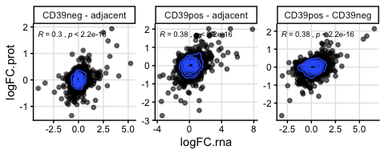
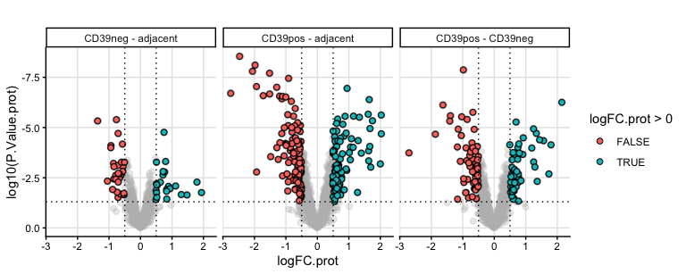
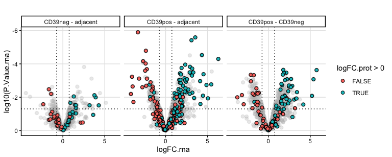
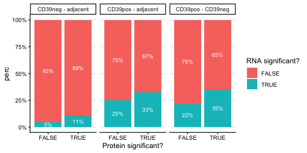
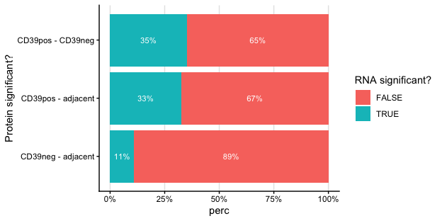
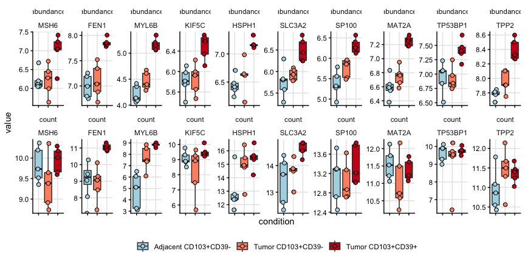
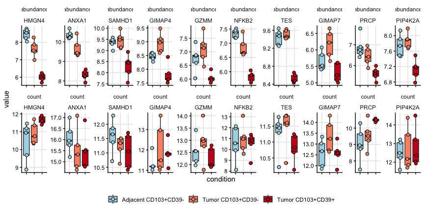

Compare bulkRNA and protein data
================
Kaspar Bresser
14/08/2025

- [Get protein expression](#get-protein-expression)
- [Get RNA expression](#get-rna-expression)
- [DE RNA](#de-rna)
- [DE protein](#de-protein)
- [combine](#combine)
- [plotting](#plotting)
- [Check overlap P values](#check-overlap-p-values)
- [example boxplots](#example-boxplots)

## Get protein expression

Import LC-MS table

``` r
prot.table <- read_tsv("Data/LCMS_NSCLC_CD8.tsv", col_names = c("gene", "patient", "abundance", "condition"), skip = 1)
```

Update old uniprot identifiers

``` r
convert <- read_excel(path = "Data/conversion.xlsx")
```

``` r
prot.table %>% 
  full_join(convert, by = c("gene" = "old")) %>% 
  mutate(gene = case_when(is.na(new) ~ gene,
                          TRUE ~ new)) %>% 
  mutate(gene = str_replace(gene, " variant protein", "")) %>% 
  select(-new) -> prot.table
```

## Get RNA expression

Import RNA expression table

``` r
rna.table <- read_csv("Data/RNAseq_NSCLC_CD8.csv")
```

tidy up to make labels the same as protein table

``` r
rna.table %>% 
  select(-c(1, 17)) %>% 
  pivot_longer(1:15, names_to = "sample", values_to = "count") %>% 
  separate(sample, into = c("tumor", "cell", "pop", "area")) %>% 
  mutate(population = case_when(pop == "SP" & area == "Tumor" ~ "Tumor CD103+CD39-",
                                pop == "DP" & area == "Tumor" ~ "Tumor CD103+CD39+",
                                TRUE ~ "Adjacent CD103+CD39-")) %>% 
  transmute(gene = Gene_names, patient = paste0("NSCLC_", tumor), condition = population, count = count) -> dat.rna
```

Tidy up protein table and combine with RNA data

``` r
prot.table %>% 
  mutate(patient = case_when(str_detect(patient, "1") ~ "NSCLC_22",
                             str_detect(patient, "2") ~ "NSCLC_41",
                             str_detect(patient, "3") ~ "NSCLC_57",
                             str_detect(patient, "SP_4") ~ "NSCLC_27",
                             str_detect(patient, "Tumor...5") ~ "NSCLC_36",
                             TRUE ~ "NSCLC_38")) -> prot.table

prot.table %>% 
  inner_join(dat.rna) -> dat.combined

dat.combined
```

    ## # A tibble: 22,455 × 5
    ##    gene  patient  abundance condition         count
    ##    <chr> <chr>        <dbl> <chr>             <dbl>
    ##  1 OAS2  NSCLC_22      7.01 Tumor CD103+CD39- 2620.
    ##  2 OAS2  NSCLC_22      6.97 Tumor CD103+CD39+ 2955.
    ##  3 OAS2  NSCLC_41      7.15 Tumor CD103+CD39- 1038.
    ##  4 OAS2  NSCLC_41      7.47 Tumor CD103+CD39+ 2931.
    ##  5 OAS2  NSCLC_57      6.67 Tumor CD103+CD39- 1583.
    ##  6 OAS2  NSCLC_57      6.99 Tumor CD103+CD39+ 2721.
    ##  7 OAS2  NSCLC_27      6.49 Tumor CD103+CD39-  472.
    ##  8 OAS2  NSCLC_38      7.38 Tumor CD103+CD39+ 2655.
    ##  9 OAS2  NSCLC_36      6.61 Tumor CD103+CD39- 2031.
    ## 10 OAS2  NSCLC_36      6.82 Tumor CD103+CD39+ 3084.
    ## # ℹ 22,445 more rows

## DE RNA

Make sample annotation table

``` r
dat.rna %>% 
  mutate(condition = case_when(
    condition == "Tumor CD103+CD39+" ~ "CD39pos", 
    condition == "Tumor CD103+CD39-" ~ "CD39neg",
    TRUE ~ "adjacent")) %>%
  distinct(sample = paste(condition, patient, sep = "_"), condition) %>%
  arrange(condition, sample) -> pheno
```

Then make the expression matrix

``` r
dat.rna %>% 
#  semi_join(prot.table, by = "gene") %>% 
  mutate(condition = case_when(condition == "Tumor CD103+CD39+" ~ "CD39pos", 
                               condition == "Tumor CD103+CD39-" ~ "CD39neg",
                               TRUE ~ "adjacent"),
  sample = paste(condition, patient, sep = "_"),
  count = log2(count+1)) %>%
  filter(!(gene %in% c("Metazoa_SRP", "Y_RNA", "BTN2A3P", "POLR2J3", "TMEM198B", "BCORP1"))) %>% 
  na.omit() %>% 
  distinct(gene, sample, count) %>%
  pivot_wider(names_from = sample, values_from = count) %>%
  column_to_rownames("gene") %>%
  as.matrix() -> expr
```

Ensure the orders match

``` r
expr <- expr[, pheno$sample]
```

Design

``` r
design <- model.matrix(~ 0 + factor(pheno$condition, levels = c("CD39pos", "CD39neg", "adjacent")))
colnames(design) <- c("CD39pos", "CD39neg", "adjacent")

design
```

    ##    CD39pos CD39neg adjacent
    ## 1        0       1        0
    ## 2        0       1        0
    ## 3        0       1        0
    ## 4        0       1        0
    ## 5        0       1        0
    ## 6        1       0        0
    ## 7        1       0        0
    ## 8        1       0        0
    ## 9        1       0        0
    ## 10       1       0        0
    ## 11       0       0        1
    ## 12       0       0        1
    ## 13       0       0        1
    ## 14       0       0        1
    ## 15       0       0        1
    ## attr(,"assign")
    ## [1] 1 1 1
    ## attr(,"contrasts")
    ## attr(,"contrasts")$`factor(pheno$condition, levels = c("CD39pos", "CD39neg", "adjacent"))`
    ## [1] "contr.treatment"

Fit the models

``` r
lm.fit.rna <- lmFit(expr, design)
contrast.matrix <- makeContrasts(
  CD39pos - CD39neg,
  CD39pos - adjacent,
  CD39neg - adjacent,
  levels = design
)
lm.fit.rna <- contrasts.fit(lm.fit.rna, contrast.matrix)
lm.fit.rna <- eBayes(lm.fit.rna)
```

grab results

``` r
get_tables <- function(coefi, res){
  topTable(res, number = Inf,  sort.by = 'none', coef = coefi) %>% 
    as_tibble(rownames = "gene.symbol") %>% 
    mutate(comparison = coefi)
}
```

``` r
colnames(lm.fit.rna$cov.coefficients) %>%
  map(~get_tables(., lm.fit.rna)) %>% 
  list_rbind() -> results.DE.rna
```

## DE protein

Make sample annotation table

``` r
prot.table %>% 
  filter(condition != "Non-naive CD8") %>%   
  mutate(condition = case_when(
    condition == "Tumor CD103+CD39+" ~ "CD39pos", 
    condition == "Tumor CD103+CD39-" ~ "CD39neg",
    TRUE ~ "adjacent")) %>%
  distinct(sample = paste(condition, patient, sep = "_"), condition) %>%
  arrange(condition, sample) -> pheno
```

Then make the expression matrix

``` r
prot.table %>% 
  filter(condition != "Non-naive CD8") %>%   
  mutate(condition = case_when(condition == "Tumor CD103+CD39+" ~ "CD39pos", 
                               condition == "Tumor CD103+CD39-" ~ "CD39neg",
                               TRUE ~ "adjacent"),
  sample = paste(condition, patient, sep = "_")) %>%
  distinct(gene, sample, abundance) %>%
  pivot_wider(names_from = sample, values_from = abundance, values_fn = mean) %>% 
  column_to_rownames("gene") %>%
  as.matrix() -> expr
```

Ensure the orders match

``` r
expr <- expr[, pheno$sample]
```

Design

``` r
design <- model.matrix(~ 0 + factor(pheno$condition, levels = c("CD39pos", "CD39neg", "adjacent")))
colnames(design) <- c("CD39pos", "CD39neg", "adjacent")

design
```

    ##    CD39pos CD39neg adjacent
    ## 1        0       1        0
    ## 2        0       1        0
    ## 3        0       1        0
    ## 4        0       1        0
    ## 5        0       1        0
    ## 6        1       0        0
    ## 7        1       0        0
    ## 8        1       0        0
    ## 9        1       0        0
    ## 10       1       0        0
    ## 11       0       0        1
    ## 12       0       0        1
    ## 13       0       0        1
    ## 14       0       0        1
    ## 15       0       0        1
    ## attr(,"assign")
    ## [1] 1 1 1
    ## attr(,"contrasts")
    ## attr(,"contrasts")$`factor(pheno$condition, levels = c("CD39pos", "CD39neg", "adjacent"))`
    ## [1] "contr.treatment"

Fit the models

``` r
lm.fit.prot <- lmFit(expr, design)
contrast.matrix <- makeContrasts(
  CD39pos - CD39neg,
  CD39pos - adjacent,
  CD39neg - adjacent,
  levels = design
)
lm.fit.prot <- contrasts.fit(lm.fit.prot, contrast.matrix)
lm.fit.prot <- eBayes(lm.fit.prot)
```

grab results

``` r
get_tables <- function(coefi, res){
  topTable(res, number = Inf,  sort.by = 'none', coef = coefi) %>% 
    as_tibble(rownames = "gene.symbol") %>% 
    mutate(comparison = coefi)
}
```

``` r
colnames(lm.fit.prot$cov.coefficients) %>%
  map(~get_tables(., lm.fit.prot)) %>% 
  list_rbind() -> results.DE.prot
```

## combine

Combine the DE analysis results

``` r
results.DE.prot %>% 
  inner_join(results.DE.rna, by = c("gene.symbol", "comparison"), suffix = c(".prot", ".rna")) -> dat.DE.all
```

``` r
write_tsv(dat.combined, "Output/data_combined.tsv")
write_tsv(dat.DE.all, "Output/data_DE_all.tsv")


dat.combined <- read_tsv("Output/data_combined.tsv")
dat.DE.all<- read_tsv( "Output/data_DE_all.tsv")
```

## plotting

Plot the correlation between RNA and protein (DE data)

``` r
dat.DE.all %>% 
  ggplot(aes(x = logFC.rna, y = logFC.prot)) +
  rasterise(geom_point(alpha = 0.6), dpi = 600, scale = 1) +
  geom_density2d(contour_var = "ndensity") +
  stat_cor(
    method = "pearson",
    aes(label = paste(..r.label.., ..p.label.., sep = "~`,`~")),
    label.x.npc = "left",
    label.y.npc = "top",
    size = 2.5
  ) +
  facet_wrap(~comparison, scales = "free") +
  theme_classic() +
  theme(panel.grid.major = element_line(color = "grey90"))
```

    ## Warning: The dot-dot notation (`..r.label..`) was deprecated in ggplot2 3.4.0.
    ## ℹ Please use `after_stat(r.label)` instead.
    ## This warning is displayed once per session.
    ## Call `lifecycle::last_lifecycle_warnings()` to see where this warning was
    ## generated.



``` r
ggsave("Figs/MSvRNA_logFC_comparison_rast.pdf", width = 6, height = 2.2)
```

Volcano, highlight significant proteins

``` r
dat.DE.all %>% 
  ggplot(aes(x = logFC.prot, y = log10(P.Value.prot))) + 
  # rasterised "background" points
  geom_point_rast(aes(fill = logFC.prot > 0), 
                  shape = 21, size = 2, alpha = 1, raster.dpi = 600) +
  # highlight "significant" points as vector (not rasterised)
  gghighlight(P.Value.prot < 0.05 & abs(logFC.prot) > 0.5,
              calculate_per_facet = TRUE, 
              use_direct_label = FALSE, unhighlighted_params = list(alpha = 0.3, shape = 19)) +
  scale_y_reverse() +
  labs(title = "") +
  theme_classic() +
  theme(plot.title = element_text(hjust = 0.5),
        panel.grid.major = element_line(color = "grey90")) +
  facet_wrap(~comparison, scales = "fixed") +
  geom_vline(xintercept = c(.5, -.5), linetype = "dotted") +
  geom_hline(yintercept = log10(0.05), linetype = "dotted")
```

    ## Warning: Tried to calculate with group_by(), but the calculation failed.
    ## Falling back to ungrouped filter operation...



``` r
ggsave("Figs/MSvRNA_volcano_protein_rast.pdf", width = 7, height = 3)
```

RNAseq volcano with significant proteins highlighted

``` r
dat.DE.all %>% 
  ggplot(aes(x = logFC.rna, y = log10(P.Value.rna))) + 
  # rasterised "background" points
  geom_point_rast(aes(fill = logFC.prot > 0), 
                  shape = 21, size = 2, alpha = 1, raster.dpi = 600) +
  # highlight "significant" points as vector (not rasterised)
  gghighlight(P.Value.prot < 0.05 & abs(logFC.prot) > 0.5,
              calculate_per_facet = TRUE, 
              use_direct_label = FALSE, unhighlighted_params = list(alpha = 0.3, shape = 19)) +
  scale_y_reverse() +
  labs(title = "") +
  theme_classic() +
  theme(plot.title = element_text(hjust = 0.5),
        panel.grid.major = element_line(color = "grey90")) +
  facet_wrap(~comparison, scales = "fixed") +
  geom_vline(xintercept = c(.5, -.5), linetype ="dotted")+
  geom_hline(yintercept = log10(0.05), linetype ="dotted")+
  scale_x_continuous(trans = scales::pseudo_log_trans(base = 2))
```

    ## Warning: Tried to calculate with group_by(), but the calculation failed.
    ## Falling back to ungrouped filter operation...



``` r
ggsave("Figs/MSvRNA_volcano_RNA_rast.pdf", width = 7, height = 3)
```

## Check overlap P values

Calculate for significant proteins, the fraction that are also
significant at the RNA level

``` r
dat.DE.all %>%
  mutate(
    prot_sig = P.Value.prot < 0.05,
    rna_sig  = P.Value.rna < 0.05
  ) %>%
  count(comparison, prot_sig, rna_sig) %>%
  group_by(comparison, prot_sig) %>%
  mutate(
    perc = n / sum(n),
    label = scales::percent(perc, accuracy = 1)
  ) %>%
  ggplot(aes(x = prot_sig, y = perc, fill = rna_sig)) +
  geom_bar(stat = "identity", position = "fill") +
  geom_text(aes(label = label), 
            position = position_fill(vjust = 0.5), size = 3, color = "white") +
  facet_wrap(~comparison) +
  scale_y_continuous(labels = scales::percent_format()) +
  labs(x = "Protein significant?", fill = "RNA significant?")+
  theme_classic()+
  theme(panel.grid.major.y = element_line(color = "grey90"))
```



``` r
ggsave("Figs/MSvRNA_PartOfWhole.pdf", width = 6.5, height = 3)
```

More compact version

``` r
dat.DE.all %>%
  mutate(prot_sig = P.Value.prot < 0.05,
         rna_sig  = P.Value.rna < 0.05) %>%
  count(comparison, prot_sig, rna_sig) %>%
  group_by(comparison, prot_sig) %>%
  mutate(perc = n / sum(n),
         label = scales::percent(perc, accuracy = 1)) %>%
  filter(prot_sig == TRUE) %>% 
ggplot(aes(x = comparison, y = perc, fill = rna_sig)) +
  geom_bar(stat = "identity", position = "fill") +
  geom_text(aes(label = label), 
            position = position_fill(vjust = 0.5), size = 3, color = "white") +
  scale_y_continuous(labels = scales::percent_format()) +
  labs(x = "Protein significant?", fill = "RNA significant?")+
  theme_classic()+
  theme(panel.grid.major.x = element_line(color = "grey90"))+
  coord_flip()
```



``` r
ggsave("Figs/MSvRNA_PartOfWhole_small.pdf", width = 5.5, height = 2)
```

## example boxplots

``` r
dat.DE.all %>% 
  filter(comparison == "CD39pos - CD39neg") %>% 
  filter(P.Value.prot < 0.005 & P.Value.rna > 0.05) %>% 
  filter(logFC.prot > 0) %>% 
  slice_max(logFC.prot, n = 10) %>% #View()
  pull(gene.symbol) -> prots

dat.combined %>% 
  dplyr::filter(gene %in% prots) %>% 
  mutate(gene = factor(gene, levels = prots), count = log2(count)) %>% 
  pivot_longer(cols = c(abundance, count), names_to = "metric", values_to = "value") %>% 
ggplot(aes(x = condition, y = value))+
  geom_boxplot(aes(fill = condition))+
  geom_jitter(aes(fill = condition), shape = 21, size = 2, width = .1)+
  scale_fill_manual(values = rev(c("#cb181d", "#fc9272", "lightblue")))+
  facet_rep_wrap(metric~gene, scales = "free", ncol = length(prots))+
  theme_classic()+
  theme(panel.grid.major = element_line(color ="grey90"), legend.title = element_blank(), 
        strip.background = element_blank(), legend.position = "bottom", axis.text.x = element_blank())#+labs(x = "RNA expression level", y = "protein expression level")
```

    ## Warning: `facet_rep_wrap` and `facet_rep_lab` have been soft-deprecated. A
    ## replacement can be found in ggh4x::facet_wrap2.

    ## Warning: Removed 1 row containing non-finite outside the scale range
    ## (`stat_boxplot()`).



``` r
#ggsave("Figs/dotplots_correlation.pdf", width = 3.8, height = 2.7)
```

``` r
dat.DE.all %>% 
  filter(comparison == "CD39pos - CD39neg") %>% 
  filter(P.Value.prot < 0.005 & P.Value.rna > 0.05) %>% 
  slice_min(logFC.prot, n = 10) %>% #View()
  pull(gene.symbol) -> prots

dat.combined %>% 
  dplyr::filter(gene %in% prots) %>% 
  mutate(gene = factor(gene, levels = prots), count = log2(count)) %>% 
  pivot_longer(cols = c(abundance, count), names_to = "metric", values_to = "value") %>% 
ggplot(aes(x = condition, y = value))+
  geom_boxplot(aes(fill = condition))+
  geom_jitter(aes(fill = condition), shape = 21, size = 2, width = .1)+
  scale_fill_manual(values = rev(c("#cb181d", "#fc9272", "lightblue")))+
  facet_rep_wrap(metric~gene, scales = "free", ncol = length(prots))+
  theme_classic()+
  theme(panel.grid.major = element_line(color ="grey90"), legend.title = element_blank(), 
        strip.background = element_blank(), legend.position = "bottom", axis.text.x = element_blank())#+labs(x = "RNA expression level", y = "protein expression level")
```

    ## Warning: `facet_rep_wrap` and `facet_rep_lab` have been soft-deprecated. A
    ## replacement can be found in ggh4x::facet_wrap2.



``` r
#ggsave("Figs/dotplots_correlation.pdf", width = 3.8, height = 2.7)
```
