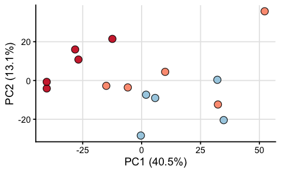
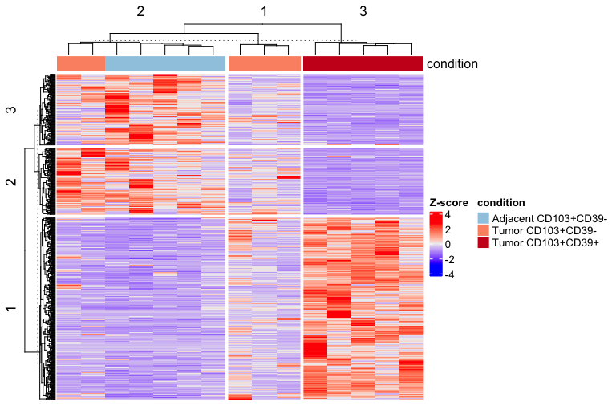
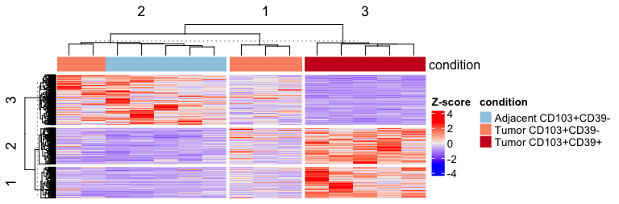
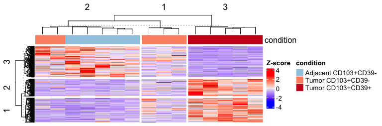
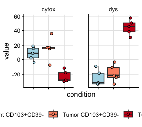

Compare bulkRNA and protein data
================
Kaspar Bresser
14/08/2025

- [Get RNA expression](#get-rna-expression)
- [PCA](#pca)
- [Differential expression](#differential-expression)
- [Heatmap DE](#heatmap-de)
- [Check gene sets](#check-gene-sets)
- [calculate scores](#calculate-scores)

## Get RNA expression

Import RNA data

``` r
rna.table <- read_csv("Data/RNAseq_NSCLC_CD8_cpm.csv")
```

Tidy up

``` r
rna.table %>% 
  select(-c(1, 17)) %>% 
  pivot_longer(1:15, names_to = "sample", values_to = "count") %>% 
  separate(sample, into = c("tumor", "cell", "pop", "area")) %>% 
  mutate(population = case_when(pop == "SP" & area == "Tumor" ~ "Tumor CD103+CD39-",
                                pop == "DP" & area == "Tumor" ~ "Tumor CD103+CD39+",
                                TRUE ~ "Adjacent CD103+CD39-")) %>% 
  transmute(gene = Gene_names, patient = paste0("NSCLC_", tumor), condition = population, count = count) -> dat.rna
```

## PCA

Get top genes

``` r
top.proteins <- dat.rna %>%
  group_by(gene) %>%
  summarise(var_abundance = var((count), na.rm = TRUE)) %>%
  arrange(desc(var_abundance)) %>%
  slice_head(n = 2000) %>%
  pull(gene)
```

Perform PCA

``` r
# Prepare the wide log2 abundance matrix for PCA
pca.mat <- dat.rna %>%
  filter(condition != "Non-naive CD8") %>% 
  mutate(sample = fct_cross(condition, patient)) %>% 
  dplyr::select(-condition, -patient) %>% 
  filter(gene %in% top.proteins) %>%  # top_proteins from heatmap step

  pivot_wider(names_from = sample, values_from = count) %>%
  column_to_rownames("gene") %>%
  as.matrix() %>%
  t() # transpose so samples are rows

# Perform PCA
pca.res <- prcomp(pca.mat, scale. = TRUE)


condition.df <- dat.rna %>%
  mutate(sample = fct_cross(condition, patient)) %>% 
  distinct(sample, condition) %>%
  column_to_rownames("sample")

# Prepare PCA dataframe
pca.df <- as.data.frame(pca.res$x) %>%
  rownames_to_column("sample") %>%
  left_join(condition.df %>% rownames_to_column("sample"), by = "sample")

# Variance explained
percentVar <- round(100 * (pca.res$sdev^2 / sum(pca.res$sdev^2)), 1)

# Plot PCA
ggplot(pca.df, aes(x = PC1, y = PC2, fill = condition)) +
  geom_point(shape = 21, size = 4, alpha = 0.9, color ="black") +
  scale_fill_manual(values = c(
      "Adjacent CD103+CD39-" = "#9ecae1",
      "Tumor CD103+CD39-" = "#fc9272",
      "Tumor CD103+CD39+" = "#cb181d")) +
  labs(x = paste0("PC1 (", percentVar[1], "%)"),
    y = paste0("PC2 (", percentVar[2], "%)"),
    color = "Condition") +
  theme_classic(base_size = 14) +
  theme(panel.grid.major = element_line(color = "grey90"),
    legend.position = "none")
```



``` r
ggsave("Figs/RNAqc_PCA.pdf", width = 3, height = 3)
```

## Differential expression

First construct a dataframe containing the samples and conditions

``` r
dat.rna %>% 
  mutate(condition = case_when(
    condition == "Tumor CD103+CD39+" ~ "CD39pos", 
    condition == "Tumor CD103+CD39-" ~ "CD39neg",
    TRUE ~ "adjacent")) %>%
  distinct(sample = paste(condition, patient, sep = "_"), condition) %>%
  arrange(condition, sample) -> pheno
```

Then make the expression matrix

``` r
dat.rna %>% 
#  semi_join(prot.table, by = "gene") %>% 
  mutate(condition = case_when(condition == "Tumor CD103+CD39+" ~ "CD39pos", 
                               condition == "Tumor CD103+CD39-" ~ "CD39neg",
                               TRUE ~ "adjacent"),
  sample = paste(condition, patient, sep = "_"),
  count = log2(count+1)) %>%
  filter(!(gene %in% c("Metazoa_SRP", "Y_RNA", "BTN2A3P", "POLR2J3", "TMEM198B", "BCORP1"))) %>% 
  na.omit() %>% 
  distinct(gene, sample, count) %>%
  pivot_wider(names_from = sample, values_from = count) %>%
  column_to_rownames("gene") %>%
  as.matrix() -> expr
```

Ensure the orders match

``` r
expr <- expr[, pheno$sample]
```

Design

``` r
design <- model.matrix(~ 0 + factor(pheno$condition, levels = c("CD39pos", "CD39neg", "adjacent")))
colnames(design) <- c("CD39pos", "CD39neg", "adjacent")

design
```

    ##    CD39pos CD39neg adjacent
    ## 1        0       1        0
    ## 2        0       1        0
    ## 3        0       1        0
    ## 4        0       1        0
    ## 5        0       1        0
    ## 6        1       0        0
    ## 7        1       0        0
    ## 8        1       0        0
    ## 9        1       0        0
    ## 10       1       0        0
    ## 11       0       0        1
    ## 12       0       0        1
    ## 13       0       0        1
    ## 14       0       0        1
    ## 15       0       0        1
    ## attr(,"assign")
    ## [1] 1 1 1
    ## attr(,"contrasts")
    ## attr(,"contrasts")$`factor(pheno$condition, levels = c("CD39pos", "CD39neg", "adjacent"))`
    ## [1] "contr.treatment"

Fit the models

``` r
lm.fit.rna <- lmFit(expr, design)
contrast.matrix <- makeContrasts(
  CD39pos - CD39neg,
  CD39pos - adjacent,
  CD39neg - adjacent,
  levels = design
)
lm.fit.rna <- contrasts.fit(lm.fit.rna, contrast.matrix)
lm.fit.rna <- eBayes(lm.fit.rna)
```

grab results

``` r
get_tables <- function(coefi, res){
  topTable(res, number = Inf,  sort.by = 'none', coef = coefi) %>% 
    as_tibble(rownames = "gene.symbol") %>% 
    mutate(comparison = coefi)
}
```

``` r
colnames(lm.fit.rna$cov.coefficients) %>%
  map(~get_tables(., lm.fit.rna)) %>% 
  list_rbind() -> results.DE.rna
```

## Heatmap DE

Get all significant genes

``` r
results.DE.rna %>% 
  filter(adj.P.Val < 0.05) %>% 
  pull(gene.symbol) %>% 
  unique() -> genes
```

Plot in a heatmap

``` r
library(ComplexHeatmap)

heatmap.mat <- dat.rna %>%
  mutate(sample = fct_cross(condition, patient)) %>% 
  dplyr::select(-condition, -patient) %>% 
  filter(gene %in% genes) %>%
  pivot_wider(names_from = sample, values_from = count) %>%
  column_to_rownames("gene") %>%
  as.matrix()

# Z-score by row
heatmap.mat <- t(scale(t(heatmap.mat)))

# Cap values at ±3
heatmap.mat[heatmap.mat > 4] <- 4
heatmap.mat[heatmap.mat < -4] <- -4

# Create column annotation
condition_df <- dat.rna %>%
  mutate(sample = fct_cross(condition, patient)) %>% 
  dplyr::select(-patient) %>% 
  dplyr::select(sample, condition) %>%
  distinct() %>%
  column_to_rownames("sample")

ha <- HeatmapAnnotation(
  condition = condition_df$condition,
  col = list(condition = c(
    "Adjacent CD103+CD39-" = "#9ecae1",
    "Tumor CD103+CD39-"    = "#fc9272",
    "Tumor CD103+CD39+"    = "#cb181d")),
  annotation_legend_param = list(condition = list(legend_direction = "horizontal")
  )
)


hm <- Heatmap(
  heatmap.mat,
  name = "Z-score", 
  top_annotation = ha,
  show_row_names = FALSE, show_column_names = F,
  row_km = 3, column_km = 3,
  clustering_distance_rows = "euclidean",
  clustering_distance_columns = "euclidean",
  heatmap_legend_param = list(title = "Z-score"),
  use_raster = TRUE,
raster_quality = 10
)

# Draw heatmap
pdf("Figs/RNAqc_heatmap.pdf", width = 5, height = 3.5)

draw(
hm , annotation_legend_side = "bottom", 

)

dev.off()
```

    ## quartz_off_screen 
    ##                 2

``` r
hm
```



## Check gene sets

Import Dysfunction gene set

``` r
genes <- read_table("Data/dysfunction_score.txt") %>% pull(Gene)

read_table(file = "Data/dysfunction_genes.txt", col_names = F) %>% 
  pull(X1) %>% 
  union(genes) -> genes
```

Plot as heatmap

``` r
heatmap.mat <- dat.rna %>%
  mutate(sample = fct_cross(condition, patient)) %>% 
  dplyr::select(-condition, -patient) %>% 
  filter(gene %in% genes) %>%
  pivot_wider(names_from = sample, values_from = count) %>%
  column_to_rownames("gene") %>%
  as.matrix()

# Z-score by row
heatmap.mat <- t(scale(t(heatmap.mat)))

# Cap values at ±3
heatmap.mat[heatmap.mat > 4] <- 4
heatmap.mat[heatmap.mat < -4] <- -4

# Create column annotation
condition_df <- dat.rna %>%
  mutate(sample = fct_cross(condition, patient)) %>% 
  dplyr::select(-patient) %>% 
  dplyr::select(sample, condition) %>%
  distinct() %>%
  column_to_rownames("sample")

ha <- HeatmapAnnotation(
  condition = condition_df$condition,
  col = list(condition = c(
    "Adjacent CD103+CD39-" = "#9ecae1",
    "Tumor CD103+CD39-"    = "#fc9272",
    "Tumor CD103+CD39+"    = "#cb181d")),
  annotation_legend_param = list(condition = list(legend_direction = "horizontal")
  )
)

# Draw heatmap
pdf("Figs/RNAqc_heatmap_DYS.pdf", width = 4.2, height = 3.5)
draw(
Heatmap(
  heatmap.mat,
  name = "Z-score", 
  top_annotation = ha,
  show_row_names = F, show_column_names = F,row_km = 1, column_km = 2,
  clustering_distance_rows = "euclidean",
  clustering_distance_columns = "euclidean",
  heatmap_legend_param = list(title = "Z-score"),
  row_names_gp = gpar(fontsize = 5)
), annotation_legend_side = "bottom"
)
dev.off()
```

    ## quartz_off_screen 
    ##                 2

``` r
hm
```



Import cytotoxicity set

``` r
read_table("Data/cytotox_score.txt") %>% 
  pull(Gene) -> genes
```

Plot as heatmap

``` r
heatmap.mat <- dat.rna %>%
  mutate(sample = fct_cross(condition, patient)) %>% 
  dplyr::select(-condition, -patient) %>% 
  filter(gene %in% genes) %>%
  pivot_wider(names_from = sample, values_from = count) %>%
  column_to_rownames("gene") %>%
  as.matrix()

# Z-score by row
heatmap.mat <- t(scale(t(heatmap.mat)))

# Cap values at ±3
heatmap.mat[heatmap.mat > 4] <- 4
heatmap.mat[heatmap.mat < -4] <- -4

# Create column annotation
condition_df <- dat.rna %>%
  mutate(sample = fct_cross(condition, patient)) %>% 
  dplyr::select(-patient) %>% 
  dplyr::select(sample, condition) %>%
  distinct() %>%
  column_to_rownames("sample")

ha <- HeatmapAnnotation(
  condition = condition_df$condition,
  col = list(condition = c(
    "Adjacent CD103+CD39-" = "#9ecae1",
    "Tumor CD103+CD39-"    = "#fc9272",
    "Tumor CD103+CD39+"    = "#cb181d")),
  annotation_legend_param = list(condition = list(legend_direction = "horizontal")
  )
)
# Draw heatmap
pdf("Figs/RNAqc_heatmap_CYTOX.pdf",  width = 4.2, height = 3.5)
draw(
Heatmap(
  heatmap.mat,
  name = "Z-score", 
  top_annotation = ha,
  show_row_names = F, show_column_names = F,row_km = 1, column_km = 3,
  clustering_distance_rows = "euclidean",
  clustering_distance_columns = "euclidean",
  heatmap_legend_param = list(title = "Z-score"),
  row_names_gp = gpar(fontsize = 5)
), annotation_legend_side = "bottom"
)
dev.off()
```

    ## quartz_off_screen 
    ##                 2

``` r
hm
```



## calculate scores

Get both scores

``` r
read_table("Data/dysfunction_score.txt") %>%
  mutate(score = "dys") %>% 
  bind_rows(read_table("Data/cytotox_score.txt") %>% mutate(score = "cytox")) -> scores
```

Calculate z-score based scores

``` r
dat.rna %>%
  inner_join(scores, by = c("gene" = "Gene")) %>% 
  group_by(gene) %>% 
  mutate(abundance_z = (count - mean(count, na.rm = TRUE)) / 
                        sd(count, na.rm = TRUE)) %>%
  group_by(patient, condition, score) %>% 
  summarise(value = sum(abundance_z)) -> dat.scored
```

and plot

``` r
ggplot(dat.scored, aes(x = condition, y = value, fill = condition))+
  geom_boxplot(outlier.shape = NA)+
  geom_point(shape = 21, position = position_jitter(width = .2))+
  facet_rep_wrap(~score)+
  theme_classic()+
  scale_fill_manual(values = rev(c("#cb181d", "#fc9272", "lightblue")))+
  theme(panel.grid.major = element_line(color = "grey90"), legend.title = element_blank(), 
        strip.background = element_blank(), legend.position = "bottom", axis.text.x = element_blank())
```

    ## Warning: `facet_rep_wrap` and `facet_rep_lab` have been soft-deprecated. A
    ## replacement can be found in ggh4x::facet_wrap2.



``` r
ggsave("Figs/RNAqc_DysCytScores.pdf", width = 2.6, height = 2.8)
```
