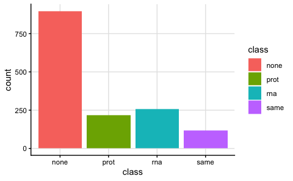
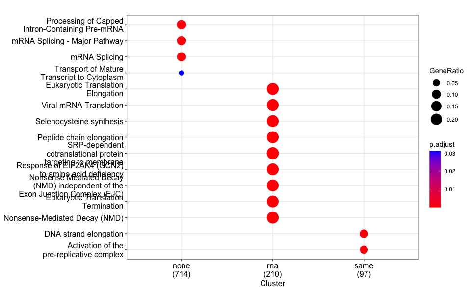
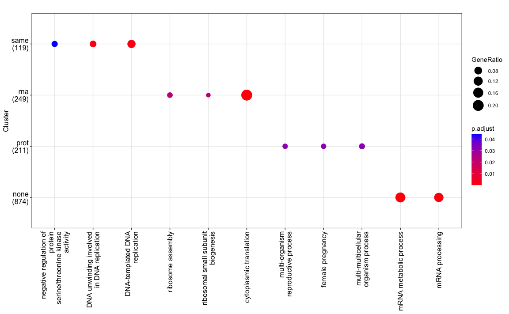
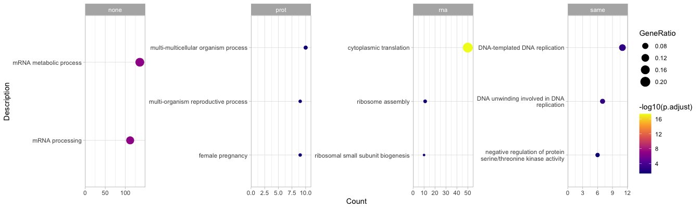
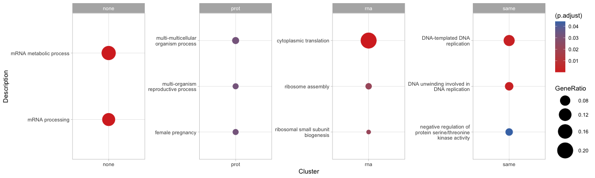
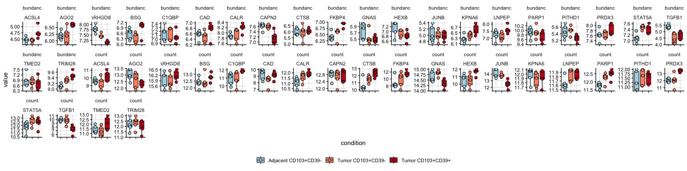
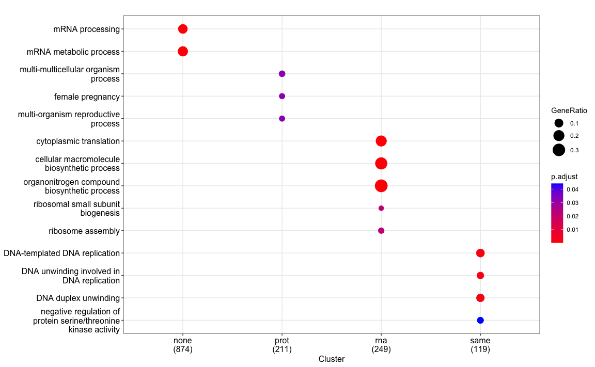

Perform cluster analysis
================
Kaspar Bresser
14/08/2025

- [Import data](#import-data)
- [Classify](#classify)
- [Test for pathways](#test-for-pathways)
- [plot some examples](#plot-some-examples)

## Import data

``` r
dat.combined <- read_tsv( "Output/data_combined.tsv")
dat.DE.all <- read_tsv("Output/data_DE_all.tsv")
```

## Classify

``` r
dat.DE.all %>% 
  filter(comparison == "CD39pos - CD39neg") %>% 
  mutate(class = case_when(P.Value.prot < 0.05 & P.Value.rna < 0.05 ~ "same",
                           P.Value.prot < 0.05 & P.Value.rna > 0.05 ~ "prot",
                           P.Value.prot > 0.05 & P.Value.rna < 0.05 ~ "rna",
                           TRUE ~ "none")) -> df.input
```

``` r
ggplot(df.input, aes(x = class, fill = class))+
  geom_bar()+
  theme_classic() +
  theme(panel.grid.major = element_line(color = "grey90"))
```



``` r
ggsave("Figs/MSvRNA_logFC_class_sizes.pdf", width = 4, height = 3)
```

## Test for pathways

``` r
## prepare input
bitr(df.input$gene.symbol, fromType = "SYMBOL", toType = "ENTREZID", OrgDb = org.Hs.eg.db) %>% 
  as_tibble() %>% 
  inner_join(df.input, by = c("SYMBOL" = "gene.symbol")) %>% 
  distinct(ENTREZID, .keep_all = TRUE) -> dat.class
```

    ## Warning in bitr(df.input$gene.symbol, fromType = "SYMBOL", toType = "ENTREZID",
    ## : 0.13% of input gene IDs are fail to map...

``` r
## define universe
bitr(unique(df.input$gene.symbol), fromType="SYMBOL", toType="ENTREZID", OrgDb="org.Hs.eg.db") %>% 
  as_tibble() %>% 
  pull(ENTREZID) -> uni
```

    ## Warning in bitr(unique(df.input$gene.symbol), fromType = "SYMBOL", toType =
    ## "ENTREZID", : 0.13% of input gene IDs are fail to map...

``` r
## enrichment per class
res <- compareCluster(
  geneClusters = ENTREZID ~ class, 
  data         = dat.class, 
  fun          = "enrichPathway", 
  universe     = uni
)

## plot
dotplot(res, showCategory = 9, size = "geneRatio")
```

    ## Warning: `aes_string()` was deprecated in ggplot2 3.0.0.
    ## ℹ Please use tidy evaluation idioms with `aes()`.
    ## ℹ See also `vignette("ggplot2-in-packages")` for more information.
    ## ℹ The deprecated feature was likely used in the enrichplot package.
    ##   Please report the issue at
    ##   <https://github.com/GuangchuangYu/enrichplot/issues>.
    ## This warning is displayed once per session.
    ## Call `lifecycle::last_lifecycle_warnings()` to see where this warning was
    ## generated.



``` r
## enrichment per class (GO Biological Process by default)
res.go <- compareCluster(
  geneClusters   = ENTREZID ~ class, 
  data           = dat.class, 
  fun            = "enrichGO", 
  universe       = uni,
  OrgDb          = org.Hs.eg.db,
  keyType        = "ENTREZID",
  ont            = "BP",       # options: "BP", "CC", "MF"
  pAdjustMethod  = "BH",
  pvalueCutoff   = 0.05,
  qvalueCutoff   = 0.2,
  readable       = TRUE
)

res.go.simpl <- simplify(
  res.go,
  cutoff = 0.55,       # semantic similarity threshold (0-1)
  by = "p.adjust",    # which column to keep the most significant term
  select_fun = min    # keep the term with minimum p.adjust in each group
)

## plot
dotplot(res.go.simpl, showCategory = 5, size = "geneRatio", label_format = 25)+
  coord_flip()+ 
  theme(axis.text.x = element_text(angle = 90, vjust = 0.5, hjust=1))
```



``` r
res.go.simpl %>% 
  as_tibble() %>% 
  separate(GeneRatio, into = c("num", "denom"), sep = "/", convert = TRUE) %>%
  mutate(GeneRatio = num / denom) %>% 
  group_by(Cluster) %>% 
  arrange(p.adjust, desc(Count)) %>% 
  slice_head(n = 4) %>% 
  mutate(Description = str_wrap(Description, width = 40),
         Description = fct_reorder(Description, GeneRatio, .desc = F)) %>%   # wrap long text
ggplot(aes(x = Count, y = Description, size = GeneRatio, color = -log10(p.adjust))) +  
  geom_point() +
  facet_wrap(~Cluster, scales = "free", nrow = 1)+
  scale_x_continuous(limits = c(0, NA), expand = expansion(mult = c(0, 0.1))) +
  scale_color_viridis_c(option = "plasma")+
  theme_light() +
  theme(panel.grid.major = element_line())
```



``` r
res.go.simpl %>% 
  as_tibble() %>% 
  separate(GeneRatio, into = c("num", "denom"), sep = "/", convert = TRUE) %>%
  mutate(GeneRatio = num / denom) %>% 
  group_by(Cluster) %>% 
  arrange(p.adjust, desc(Count)) %>% 
  slice_head(n = 4) %>% 
  mutate(Description = str_wrap(Description, width = 25),
         Description = fct_reorder(Description, GeneRatio, .desc = F)) %>%   # wrap long text
ggplot(aes(x = Cluster, y = Description, size = GeneRatio, color = (p.adjust))) +  
  geom_point() +
  facet_wrap(~Cluster, scales = "free", nrow = 1)+
  scale_size(range = c(3, 12)) + 
  scale_color_gradient(low = "#D73027", high = "#4575B4")+
  theme_light() +
  theme(panel.grid.major = element_line())
```



``` r
hallmark <- msigdbr(species = "Homo sapiens",
                    collection = "H"
) %>%
  left_join(dat.class, by = c("gene_symbol" = "SYMBOL")) %>% 
  dplyr::select(gs_name, ENTREZID) %>% 
  na.omit()
```

``` r
res.hm <- compareCluster(
  geneClusters   = ENTREZID ~ class,
  data           = dat.class,
  fun            = "enricher",
  TERM2GENE      = hallmark,
  universe       = uni,
  pAdjustMethod  = "BH",
  pvalueCutoff   = 0.05,
  qvalueCutoff   = 0.2
)
```

## plot some examples

``` r
path.BP <- msigdbr(species = "Homo sapiens", collection = "C5", subcollection = "GO:BP") 
```

``` r
path.BP %>% 
  filter(str_detect(gs_name, "GOBP_MULTI_MULTICELLULAR_ORGANISM_PROCESS")) %>% 
  pull(gene_symbol) -> gene.symbols

dat.combined %>% 
  filter(gene %in% gene.symbols) %>% 
  mutate(gene = factor(gene, levels = gene.symbols), count = log2(count)) %>% 
  pivot_longer(cols = c(abundance, count), names_to = "metric", values_to = "value") %>% 
ggplot(aes(x = condition, y = value))+
  geom_boxplot(aes(fill = condition))+
  geom_jitter(aes(fill = condition), shape = 21, size = 2, width = .1)+
  scale_fill_manual(values = rev(c("#cb181d", "#fc9272", "lightblue")))+
  facet_rep_wrap(metric~gene, scales = "free", ncol = 20)+
  theme_classic()+
  theme(panel.grid.major = element_line(color = "grey90"), legend.title = element_blank(), 
        strip.background = element_blank(), legend.position = "bottom", axis.text.x = element_blank())
```

    ## Warning: `facet_rep_wrap` and `facet_rep_lab` have been soft-deprecated. A
    ## replacement can be found in ggh4x::facet_wrap2.



``` r
## enrichment per class (GO Biological Process by default)
res.go <- compareCluster(
  geneClusters   = ENTREZID ~ class, 
  data           = dat.class, 
  fun            = "enrichGO", 
  universe       = uni,
  OrgDb          = org.Hs.eg.db,
  keyType        = "ENTREZID",
  ont            = "BP",       # options: "BP", "CC", "MF"
  pAdjustMethod  = "BH",
  pvalueCutoff   = 0.05,
  qvalueCutoff   = 0.2,
  readable       = TRUE
)

res.go.simpl <- simplify(
  res.go,
  cutoff = 0.65,       # semantic similarity threshold (0-1)
  by = "p.adjust",    # which column to keep the most significant term
  select_fun = min    # keep the term with minimum p.adjust in each group
)

## plot
dotplot(res.go.simpl, showCategory = 9, size = "geneRatio")
```


