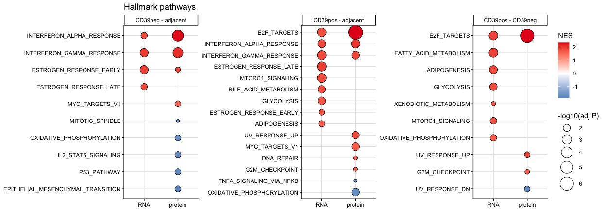

GSEA protein and RNA
================
Kaspar Bresser
14/08/2025

- [Import data](#import-data)
- [Pathway testing](#pathway-testing)

## Import data

``` r
dat.combined <- read_tsv( "Output/data_combined.tsv")
dat.DE.all <- read_tsv("Output/data_DE_all.tsv")
```

## Pathway testing

set function for testing. Will use ClusterProfiler package. Function
will test both RNA and protein level, and output a tibble with the
results of both.

``` r
test_pathways <- function(dat, pathways, comp){
  
  # get prot FC
  dat %>% 
    filter(comparison == comp) %>% 
    dplyr::select(gene.symbol, logFC.prot) -> dat.prot
  
  # Get RNA FC
  dat %>% 
    filter(comparison == comp) %>% 
    dplyr::select(gene.symbol, logFC.rna) -> dat.rna
  
  # Make vector of pathway  symbols
  paths <-  pathways[, c("gs_name", "gene_symbol")]
  
  # Make vector of protein FCs
  gene.list.vec <- dat.prot$logFC.prot
  names(gene.list.vec) <- dat.prot$gene.symbol
  gene.list.vec <- sort(gene.list.vec, decreasing = TRUE)


 # test for pathways in proteins
  gsea.res.prot <- GSEA(
    geneList = gene.list.vec, # logFC ranked
    TERM2GENE = paths,
    pvalueCutoff = 0.05)
  
  # make vector of RNA FCs
  gene.list.vec <- dat.rna$logFC.rna
  names(gene.list.vec) <- dat.rna$gene.symbol
  gene.list.vec <- sort(gene.list.vec, decreasing = TRUE)

  # Test for pathways in RNA
  gsea.res.rna <- GSEA(
    geneList = gene.list.vec, # logFC ranked
    TERM2GENE = paths,
    pvalueCutoff = 0.05)
  
  # Output dataframe
  bind_rows(
    as.data.frame(gsea.res.rna) %>% mutate(metric = "RNA"),
    as.data.frame(gsea.res.prot) %>% mutate(metric = "protein")) %>%
   # dplyr::select(Description, metric, NES, p.adjust) %>% 
    mutate(comparison = comp)
  
}
```

Get Hallmark pathways

``` r
pathways <- msigdbr(species = "Homo sapiens", db_species = "HS", collection = "H")
```

map the function over the different comparisons (populations)

``` r
dat.DE.all %>% 
  pull(comparison) %>% 
  unique() %>% 
  map(~test_pathways(dat = dat.DE.all, pathways = pathways, comp = .)) %>% 
  list_rbind() -> results.hallmark
```

Reorder the pathway names and tidy up

``` r
results.hallmark %>%
  mutate(Description = str_remove(Description, "HALLMARK_") ) %>%
  group_by(comparison, Description) %>%
  mutate(presence = case_when(any(metric == "RNA") & any(metric == "protein") ~ 1,
                               any(metric == "RNA")                            ~ 2,
                               any(metric == "protein")                        ~ 3)) %>%
  ungroup() %>% 
  mutate(Description_ord = reorder_within(Description,
                                          presence * 100 - NES,
                                          comparison)) -> to.plot

to.plot
```

    ## # A tibble: 42 × 15
    ##    ID         Description setSize enrichmentScore   NES  pvalue p.adjust  qvalue
    ##    <chr>      <chr>         <int>           <dbl> <dbl>   <dbl>    <dbl>   <dbl>
    ##  1 HALLMARK_… E2F_TARGETS      58           0.570  1.93 6.05e-5  1.92e-3 1.45e-3
    ##  2 HALLMARK_… FATTY_ACID…      56           0.567  1.90 9.87e-5  1.92e-3 1.45e-3
    ##  3 HALLMARK_… ADIPOGENES…      46           0.571  1.85 3.47e-4  4.52e-3 3.41e-3
    ##  4 HALLMARK_… GLYCOLYSIS       46           0.557  1.81 7.20e-4  7.02e-3 5.31e-3
    ##  5 HALLMARK_… MTORC1_SIG…      77           0.481  1.70 1.70e-3  1.33e-2 1.00e-2
    ##  6 HALLMARK_… OXIDATIVE_…      81           0.468  1.66 2.36e-3  1.53e-2 1.16e-2
    ##  7 HALLMARK_… XENOBIOTIC…      29           0.575  1.72 7.39e-3  4.12e-2 3.11e-2
    ##  8 HALLMARK_… E2F_TARGETS      58           0.663  2.35 2.25e-8  8.76e-7 6.86e-7
    ##  9 HALLMARK_… UV_RESPONS…      15          -0.729 -1.90 2.15e-3  2.80e-2 2.19e-2
    ## 10 HALLMARK_… UV_RESPONS…      33           0.585  1.87 1.60e-3  2.80e-2 2.19e-2
    ## # ℹ 32 more rows
    ## # ℹ 7 more variables: rank <dbl>, leading_edge <chr>, core_enrichment <chr>,
    ## #   metric <chr>, comparison <chr>, presence <dbl>, Description_ord <fct>

Output data

``` r
write_tsv(to.plot, "Output/GSEA_pathways_Hallmark.tsv")
```

And plot

``` r
ggplot(to.plot, aes(x = fct_rev(metric), y = fct_rev(Description_ord), size = -log10(p.adjust), fill = NES))+
  geom_point(color = "black", shape = 21) +
  scale_fill_gradient2(low = "#377eb8", mid = "white", high = "#e41a1c", midpoint = 0)+
  scale_size(range = c(2, 10))+
  facet_rep_wrap(~comparison, scales = "free_y")+
  tidytext::scale_y_reordered() +
  theme_classic() +
  labs(color = "NES", size = "-log10(adj P)", x = NULL, y = NULL, title = "Hallmark pathways")+
  theme(panel.grid.major = element_line(color = "grey90"))
```

    ## Warning: `facet_rep_wrap` and `facet_rep_lab` have been soft-deprecated. A
    ## replacement can be found in ggh4x::facet_wrap2.



``` r
ggsave("Figs/GSEA_Hallmark_all.pdf", height = 5.6, width = 12.5)
```
