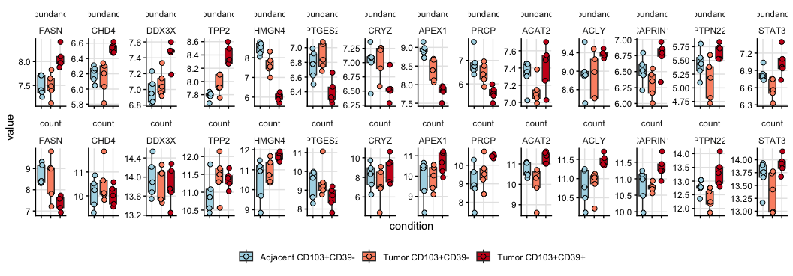
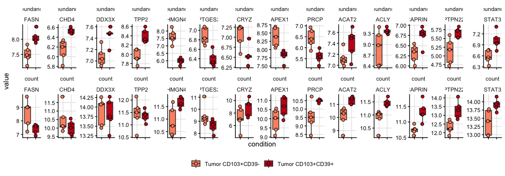
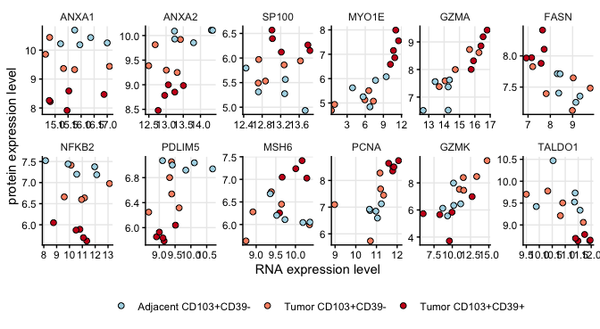
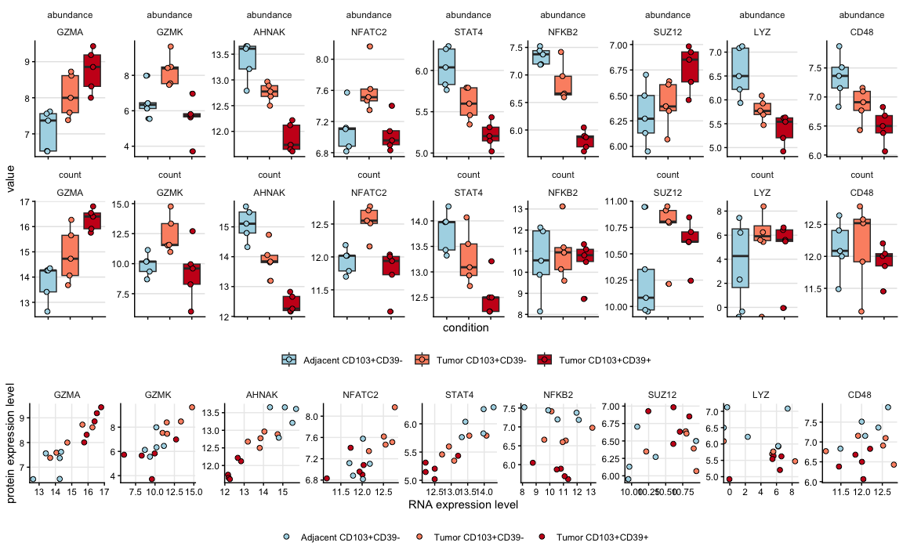

Compare bulkRNA and protein data
================
Kaspar Bresser
14/08/2025

- [](#section)
- [Selected proteins](#selected-proteins)
- [Correlations](#correlations)

Make some example vizualisations

## 

Import data

``` r
dat.combined <- read_tsv( "Output/data_combined.tsv")
dat.DE.all <- read_tsv("Output/data_DE_all.tsv")
```

## Selected proteins

Plot proteins that were selected for follow-up

``` r
prots <-  c("FASN", "CHD4", "DDX3X", "TPP2", "HMGN4", "PTGES2",  "CRYZ", "APEX1", "PRCP",
            "ACAT2", "ACLY", "CAPRIN1", "PTPN22", "STAT3")

dat.combined %>% 
  dplyr::filter(gene %in% prots) %>% 
  mutate(gene = factor(gene, levels = prots), count = log2(count)) %>% 
  pivot_longer(cols = c(abundance, count), names_to = "metric", values_to = "value") %>% 
ggplot(aes(x = condition, y = value))+
  geom_boxplot(aes(fill = condition))+
  geom_jitter(aes(fill = condition), shape = 21, size = 2, width = .1)+
  scale_fill_manual(values = rev(c("#cb181d", "#fc9272", "lightblue")))+
  facet_rep_wrap(metric~gene, scales = "free", nrow = 2)+
  theme_classic()+
  theme(panel.grid.major = element_line(color = "grey90"), legend.title = element_blank(), 
        strip.background = element_blank(), legend.position = "bottom", axis.text.x = element_blank())
```

    ## Warning: `facet_rep_wrap` and `facet_rep_lab` have been soft-deprecated. A
    ## replacement can be found in ggh4x::facet_wrap2.



``` r
ggsave("Figs/MSvRNA_boxplots_selection.pdf", width = 12, height = 4)
```

Specifically plot tumor-derived populations

``` r
dat.combined %>% 
  filter(str_detect(condition, "Tumor")) %>% 
  dplyr::filter(gene %in% prots) %>% 
  mutate(gene = factor(gene, levels = prots), count = log2(count)) %>% 
  pivot_longer(cols = c(abundance, count), names_to = "metric", values_to = "value") %>% 
ggplot(aes(x = condition, y = value))+
  geom_boxplot(aes(fill = condition))+
  geom_jitter(aes(fill = condition), shape = 21, size = 2, width = .1)+
  scale_fill_manual(values = rev(c("#cb181d", "#fc9272")))+
  facet_rep_wrap(metric~gene, scales = "free", nrow = 2)+
  theme_classic()+
  theme(panel.grid.major = element_line(color = "grey90"), legend.title = element_blank(), 
        strip.background = element_blank(), legend.position = "bottom", axis.text.x = element_blank())
```

    ## Warning: `facet_rep_wrap` and `facet_rep_lab` have been soft-deprecated. A
    ## replacement can be found in ggh4x::facet_wrap2.



``` r
#ggsave("Figs/dotplots_correlation.pdf", width = 3.8, height = 2.7)
```

## Correlations

Calculate Spearman correlation between protein abundance and gene counts

``` r
dat.combined %>% 
  group_by(gene) %>%
  mutate(count = log2(count)) %>% 
  cor_test(count, abundance, method = "spearman") -> dat.cors
```

Combine with DE data

``` r
dat.cors %>% 
  dplyr::select(gene, cor, p) %>% 
  inner_join(dat.DE.all, by = c("gene" = "gene.symbol")) -> dat.all.stats
```

``` r
dat.all.stats %>% 
  filter(P.Value.prot < 0.05 & p > 0.05)
```

    ## # A tibble: 688 × 16
    ##    gene     cor     p logFC.prot AveExpr.prot t.prot P.Value.prot adj.P.Val.prot
    ##    <chr>  <dbl> <dbl>      <dbl>        <dbl>  <dbl>        <dbl>          <dbl>
    ##  1 AAK1    0.37 0.173     -0.275         7.67  -3.03      0.00824         0.0773
    ##  2 ABHD1…  0.37 0.169     -0.474         6.43  -2.49      0.0245          0.160 
    ##  3 ACADSB  0.29 0.295     -0.228         5.51  -2.23      0.0405          0.215 
    ##  4 ACADSB  0.29 0.295     -0.264         5.51  -2.59      0.0202          0.0803
    ##  5 ACADVL  0.42 0.119     -0.367         7.46  -2.38      0.0303          0.325 
    ##  6 ACAP2   0.25 0.361     -0.192         5.82  -2.14      0.0484          0.150 
    ##  7 ACAT1  -0.12 0.667     -1.11          8.16  -3.58      0.00260         0.0210
    ##  8 ACO2   -0.3  0.271     -0.277         8.99  -2.41      0.0288          0.174 
    ##  9 ACO2   -0.3  0.271     -0.327         8.99  -2.84      0.0120          0.0573
    ## 10 ADA     0.35 0.206     -0.375         5.28  -2.22      0.0417          0.219 
    ## # ℹ 678 more rows
    ## # ℹ 8 more variables: B.prot <dbl>, comparison <chr>, logFC.rna <dbl>,
    ## #   AveExpr.rna <dbl>, t.rna <dbl>, P.Value.rna <dbl>, adj.P.Val.rna <dbl>,
    ## #   B.rna <dbl>

Output stats

``` r
write_tsv(dat.all.stats, "Output/data_DEandCors.tsv")
```

Check out some interesting proteins

``` r
prots <- c("ANXA1",  "ANXA2", "SP100", "MYO1E", "GZMA", "FASN",
           "NFKB2", "PDLIM5", "MSH6", "PCNA", "GZMK", "TALDO1")

dat.combined %>% 
  dplyr::filter(gene %in% prots) %>% 
  mutate(gene = factor(gene, levels = prots)) %>% 
  ggplot(aes(x = log2(count), y = abundance))+
  geom_point(aes(fill = condition), shape = 21, size = 2)+
  scale_fill_manual(values = rev(c("#cb181d", "#fc9272", "lightblue")))+
  facet_rep_wrap(~gene, scales = "free", nrow = 2)+
  theme_classic()+
  theme(panel.grid.major = element_line(color = "grey92"), legend.title = element_blank(), strip.background = element_blank(), legend.position = "bottom")+
  labs(x = "RNA expression level", y = "protein expression level")
```

    ## Warning: `facet_rep_wrap` and `facet_rep_lab` have been soft-deprecated. A
    ## replacement can be found in ggh4x::facet_wrap2.



``` r
ggsave("Figs/dotplots_correlation.pdf", width = 7, height = 3.5)
```

Make dot plots for selected genes to show correlation

``` r
prots <- c("GZMA",  "GZMK", "AHNAK", "NFATC2", "STAT4", 
           "NFKB2", "SUZ12",  "LYZ", "CD48")

p1 <- dat.combined %>% 
  dplyr::filter(gene %in% prots) %>% 
  mutate(name = factor(gene, levels = prots)) %>% 
ggplot(aes(x = log2(count), y = abundance))+
  geom_point(aes(fill = condition), shape = 21, size = 2)+
  scale_fill_manual(values = rev(c("#cb181d", "#fc9272", "lightblue")))+
  facet_rep_wrap(~name, scales = "free", nrow = 1)+
  theme_classic()+
  theme(panel.grid.major = element_line(color = "grey92"), legend.title = element_blank(), strip.background = element_blank(), legend.position = "bottom")+
  labs(x = "RNA expression level", y = "protein expression level")
```

    ## Warning: `facet_rep_wrap` and `facet_rep_lab` have been soft-deprecated. A
    ## replacement can be found in ggh4x::facet_wrap2.

Also make plots as boxes

``` r
p2 <- dat.combined %>% 
  dplyr::filter(gene %in% prots) %>% 
  mutate(gene = factor(gene, levels = prots), count = log2(count)) %>% 
  pivot_longer(cols = c(abundance, count), names_to = "metric", values_to = "value") %>% 
ggplot(aes(x = condition, y = value))+
  geom_boxplot(aes(fill = condition))+
  geom_jitter(aes(fill = condition), shape = 21, size = 2, width = .1)+
  scale_fill_manual(values = rev(c("#cb181d", "#fc9272", "lightblue")))+
  facet_rep_wrap(metric~gene, scales = "free", ncol = length(prots))+
  theme_classic()+
  theme(panel.grid.major.y = element_line(color = "grey90"), legend.title = element_blank(), 
        strip.background = element_blank(), legend.position = "bottom", axis.text.x = element_blank())
```

    ## Warning: `facet_rep_wrap` and `facet_rep_lab` have been soft-deprecated. A
    ## replacement can be found in ggh4x::facet_wrap2.

Combine and visualize

``` r
library(ggpubr)

ggarrange(plotlist = list(p2, p1), nrow = 2, heights = c(2.15,1))
```

    ## Warning: Removed 2 rows containing non-finite outside the scale range
    ## (`stat_boxplot()`).



``` r
ggsave("Figs/example_plots.pdf", width = 9.5, height = 6.5)
```
